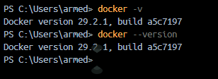
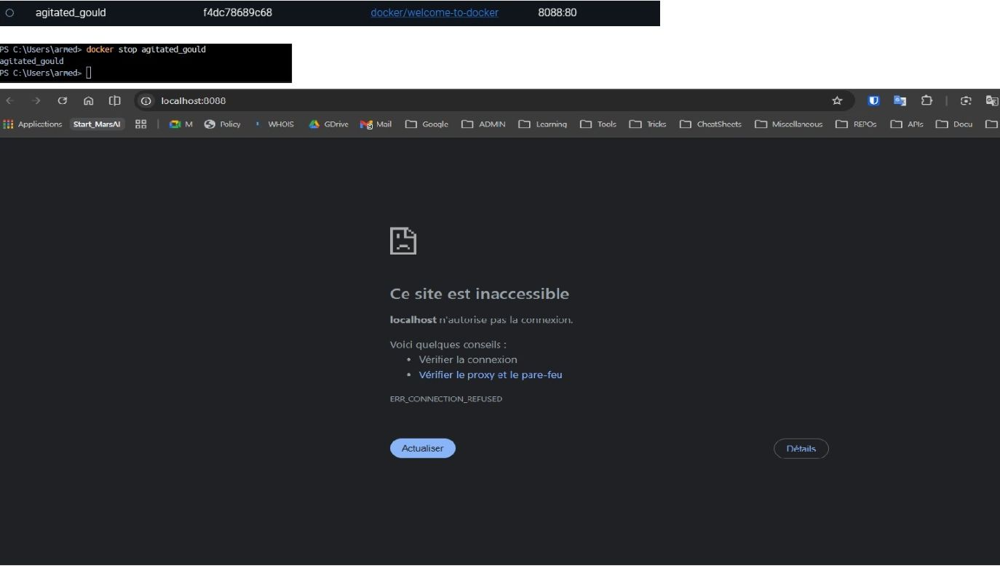

## Job 01 : Welcome to Docker & Commandes de base

**Objectif :** Préparer l'environnement et manipuler les commandes fondamentales.
**Prérequis :** Avoir Docker installé et en cours d'exécution.

¤ [Lien du fichier d'installation](https://docs.docker.com/desktop/install/windows-install/)
¤ [Lien de la documentation](https://docs.docker.com/reference/)

Puis dans Visual-studio ou dans terminal (cmd, powershell...) on va taper les commandes de base pour vérifier que Docker est bien installé et opérationnel.

### 1. Vérification de l'installation

_Pour s'assurer que Docker est bien installé et opérationnel, on vérifie la version :_

```bash
docker --version
# ou docker -v
```



> version **29.2.1** => **docker** est bien installé

### 2. Informations système

```bash
docker info
```


> **info** permet d'afficher toutes les infos du système Docker (Conteneurs, Images, etc.)

---

## Test des commandes de base

### 3. Vérifier les conteneurs en cours d'exécution

```bash
docker ps
```


> Affiche les conteneurs actuellement actifs. Aucun au départ.

### 4. Lister les images disponibles localement

```bash
docker images
```


> Montre les images Docker présentes sur la machine.

### 5. Lancer le conteneur "Welcome to Docker"

```bash
docker run -it --rm -p 8088:80 docker/welcome-to-docker
```


> Lance un conteneur en mode interactif (-it), expose le port 8088 de la machine vers le port 80 du conteneur, et supprime le conteneur automatiquement à l'arrêt (--rm).
>
> **Résultat :** Accès à http://localhost:8088 dans un navigateur
> **_Notes :_**
>
> - Le conteneur doit être arrêté manuellement (CTRL+C) pour revenir au terminal.
> - Pour faire tourner le conteneur en arrière-plan, utiliser `-d` (détaché) et entrer `docker stop <id>` pour l'arrêter ensuite:
>   `docker run -d -p 8088:80 docker/welcome-to-docker`
>   puis
>   `docker stop <id>` pour arrêter.
> - Les options `-it` et `-d` peuvent être combinées pour lancer en mode interactif et détaché (mais il faut alors gérer les logs pour voir la sortie du conteneur).

### 6. Arrêter le conteneur

```bash
docker stop <container_id|container_name>
```



> Arrête "gracieusement" le conteneur (sans le supprimer).

### 7. Télécharger l'image hello-world

```bash
docker pull hello-world
```


> Télécharge l'image "hello-world" depuis Docker Hub vers la machine locale.

### 8. Vérifier que l'image est bien présente

```bash
docker images
```


> Hello-world doit maintenant apparaître dans la liste des images locales.

### 9. Lancer le conteneur hello-world

```bash
docker run --rm hello-world
```


> Lance le conteneur hello-world. L'option --rm supprime automatiquement le conteneur après son exécution.
>
> **Résultat :** Affiche un message de bienvenue et s'arrête.

### 10. Actions de suppression - Guide complet

#### **A. Supprimer des CONTENEURS**

**1️⃣ Supprimer un conteneur spécifique** (connu par son ID ou nom)

```bash
# Par ID (avec les premiers caractères)
docker rm a1b2c3d4e5f6

# Par nom complet
docker rm mon-conteneur
```

> ✅ Le conteneur doit être **arrêté** avant la suppression. S'il est actif, un message d'erreur apparaît.

---

**2️⃣ Supprimer plusieurs conteneurs spécifiques**

```bash
# Par IDs
docker rm a1b2c3d4e5f6 g7h8i9j0k1l2

# Par noms
docker rm conteneur1 conteneur2 conteneur3
```

> ✅ Énumérer les IDs ou noms séparés par des espaces.

---

**3️⃣ Supprimer TOUS les conteneurs arrêtés**

```bash
docker rm $(docker ps -a -q)
```

> ⚠️ **Explication :**
>
> - `docker ps -a` : lister tous les conteneurs (actifs + arrêtés)
> - `-q` : afficher uniquement les IDs (quiet mode)
> - `$(...)` : substitution de commande (exécuter la commande imbriquée)
>
> ✅ Cette commande supprime **TOUS** les conteneurs, y compris les actifs !

---

**4️⃣ Supprimer TOUS les conteneurs arrêtés (méthode sûre)**

```bash
docker container prune
```

> ✅ **Beaucoup plus sûr !** Cette commande supprime uniquement les conteneurs **arrêtés**.
>
> ⚠️ Docker affiche une confirmation avant de procéder.

---

**5️⃣ Forcer la suppression d'un conteneur ACTIF/EN COURS D'EXÉCUTION**

```bash
# Option 1 : Arrêter puis supprimer
docker stop mon-conteneur
docker rm mon-conteneur

# Option 2 : Forcer la suppression directe (non recommandé)
docker rm -f mon-conteneur
```

> ⚠️ **ATTENTION** :
>
> - `-f` = force (force la suppression sans arrêter d'abord)
> - Cette option peut causer une perte de données si le conteneur écrit encore
> - ✅ Préférer arrêter d'abord avec `docker stop`

---

#### **B. Supprimer des IMAGES**

**6️⃣ Supprimer une image spécifique**

```bash
# Par ID
docker rmi a1b2c3d4e5f6

# Par nom:tag
docker rmi hello-world
docker rmi docker/welcome-to-docker:latest
```

> ✅ L'image doit **ne pas être utilisée** par un conteneur (même arrêté).

---

**7️⃣ Supprimer plusieurs images spécifiques**

```bash
# Par IDs
docker rmi a1b2c3d4e5f6 g7h8i9j0k1l2

# Par noms
docker rmi hello-world ubuntu node:latest
```

> ✅ Énumérer les IDs ou noms séparés par des espaces.

---

**8️⃣ Supprimer TOUTES les images non utilisées**

```bash
docker image prune
```

> ✅ Supprime uniquement les images **orphelines** (non utilisées par aucun conteneur).
>
> ⚠️ Docker affiche une confirmation avant de procéder.

---

**9️⃣ Supprimer TOUTES les images non utilisées (Aggressif)**

```bash
docker image prune -a
```

> ⚠️ **ATTENTION** : Supprime aussi les images **jamais utilisées**.
>
> Utiliser avec prudence !

---

**🔟 Forcer la suppression d'une image**

```bash
# Si l'image est utilisée par un conteneur (même arrêté)
docker rmi -f mon-image:latest

# Ou supprimer le conteneur d'abord (recommandé)
docker rm mon-conteneur
docker rmi mon-image:latest
```

> ⚠️ **ATTENTION** :
>
> - `-f` = force (supprime même si utilisée)
> - ✅ Meilleure pratique : supprimer les conteneurs d'abord, puis les images

---

#### **C. Démonstration pratique**

**Cas d'usage réel :**

```bash
# 1. Voir l'état actuel
docker ps -a        # Tous les conteneurs
docker images       # Toutes les images

# 2. Arrêter tous les conteneurs actifs
docker stop $(docker ps -q)

# 3. Supprimer les conteneurs arrêtés (méthode sûre)
docker container prune

# 4. Supprimer les images inutilisées (méthode sûre)
docker image prune

# 5. Vérifier le nettoyage
docker ps -a
docker images
```

---

#### **D. Questions pédagogiques du PDF - Synthèse**

| Question                      | Commande                 | Notes                             |
| ----------------------------- | ------------------------ | --------------------------------- |
| **Supprimer 1 conteneur**     | `docker rm <id>`         | Doit être arrêté                  |
| **Supprimer N conteneurs**    | `docker rm id1 id2 id3`  | Énumérer les IDs                  |
| **Tous les arrêtés**          | `docker container prune` | ✅ Sûr et recommandé              |
| **Forcer suppression active** | `docker rm -f <id>`      | ⚠️ Risqué, préférer `docker stop` |
| **Supprimer 1 image**         | `docker rmi <image>`     | Non utilisée requise              |
| **Supprimer N images**        | `docker rmi img1 img2`   | Énumérer les images               |
| **Toutes non utilisées**      | `docker image prune`     | ✅ Sûr et recommandé              |
| **Toutes orphelines**         | `docker image prune -a`  | ⚠️ Plus agressif                  |
| **Forcer suppression image**  | `docker rmi -f <image>`  | ⚠️ Risqué                         |

---

#### **E. Erreurs courantes et corrections**

**❌ ERREUR 1 :** Essayer de supprimer un conteneur actif

```bash
# ❌ Ceci échoue :
docker rm mon-conteneur

# Error response from daemon: You cannot remove a running container...

# ✅ CORRECTION :
docker stop mon-conteneur
docker rm mon-conteneur

# Ou forcer (non recommandé) :
docker rm -f mon-conteneur
```

---

**❌ ERREUR 2 :** Essayer de supprimer une image utilisée

```bash
# ❌ Ceci échoue :
docker rmi mon-image

# Error response from daemon: conflict: unable to remove repository reference...

# ✅ CORRECTION :
# Identifier le(s) conteneur(s) qui l'utilise(nt) :
docker ps -a | grep mon-image

# Supprimer les conteneurs d'abord :
docker rm <container_id>

# Puis supprimer l'image :
docker rmi mon-image
```

---

**❌ ERREUR 3 :** Utiliser `docker rm` au lieu de `docker rmi`

```bash
# ❌ ERREUR (confondre conteneur et image) :
docker rm hello-world  # Ceci cherche un conteneur, pas une image!

# ✅ CORRECTION :
docker rmi hello-world  # Supprimer une image (rmi = rm image)
docker rm conteneur1    # Supprimer un conteneur
```

---

**❌ ERREUR 4 :** Oubli de l'option `-f` quand on force

```bash
# ❌ Ceci ne force pas vraiment :
docker stop -f mon-conteneur  # -f n'existe pas pour stop

# ✅ CORRECTION :
docker kill mon-conteneur     # Tuer le conteneur (force)
# OU
docker rm -f mon-conteneur    # Forcer la suppression (-f sur rm)
```

---

### 10bis. Nettoyage complet (optionnel)

**Arrêter tous les conteneurs actifs :**

```bash
docker stop $(docker ps -q)
```

**Supprimer tous les conteneurs (arrêtés et actifs) :**

```bash
# ⚠️ Attention : supprime vraiment TOUS les conteneurs !
docker rm $(docker ps -a -q)

# ✅ Meilleure pratique (supprime uniquement les arrêtés) :
docker container prune
```

**Supprimer une image :**

```bash
docker rmi hello-world
# ou forcer la suppression (si utilisée)
docker rmi -f docker/welcome-to-docker
```

---

## ✅ Job 01 - Résumé

| Étape              | Commande                                            | Résultat             |
| ------------------ | --------------------------------------------------- | -------------------- |
| Vérif installation | `docker --version`                                  | v29.2.1 ✅           |
| Infos système      | `docker info`                                       | Détails Docker ✅    |
| Conteneurs actifs  | `docker ps`                                         | Aucun au départ ✅   |
| Images présentes   | `docker images`                                     | Aucune au départ ✅  |
| Lancer Welcome     | `docker run -d -p 8088:80 docker/welcome-to-docker` | Conteneur démarré ✅ |
| Arrêter conteneur  | `docker stop <id>`                                  | Conteneur stoppé ✅  |
| Télécharger image  | `docker pull hello-world`                           | Image récupérée ✅   |
| Lancer Hello-World | `docker run --rm hello-world`                       | Message affiché ✅   |

---
