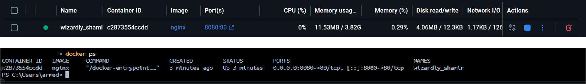
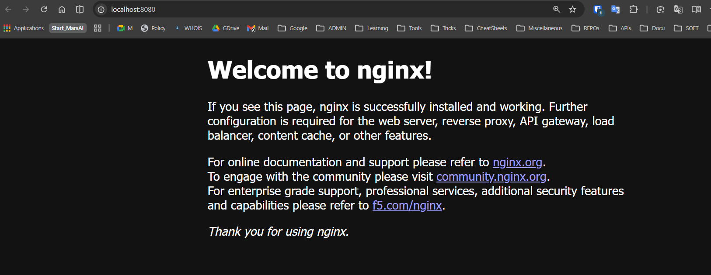
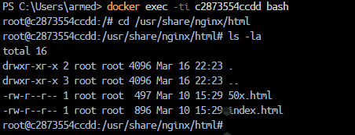
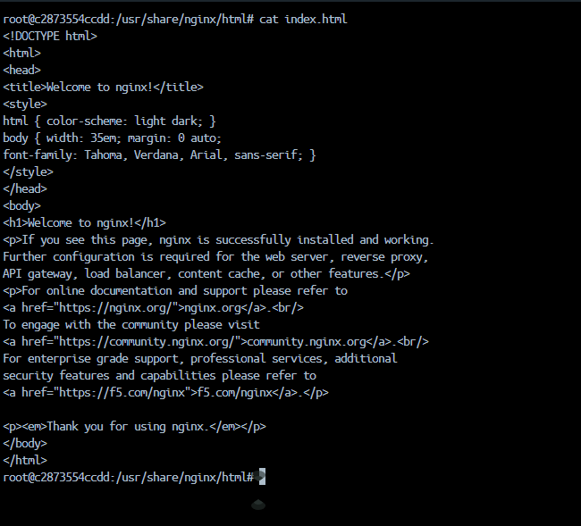
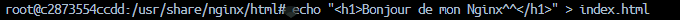
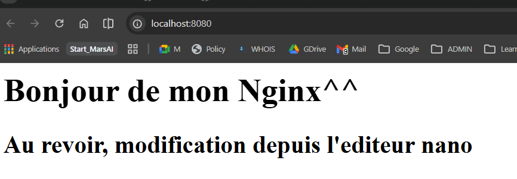
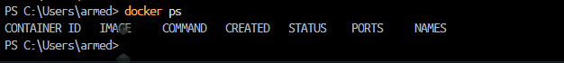
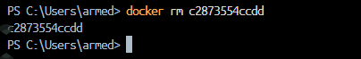
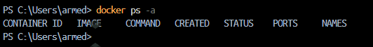
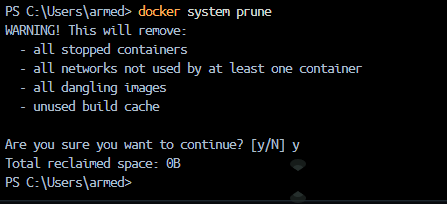

## Job 02 : Démarrer un serveur Nginx avec Docker 🌐

**Objectif :** Lancer un serveur web Nginx dans un conteneur Docker, le configurer et manipuler ses fichiers en temps réel. Cet exercice démontre comment accéder à l'intérieur d'un conteneur actif et modifier ses fichiers dynamiquement.

**Prérequis :** Job 01 complété, Docker opérationnel.

**Image utilisée :** `nginx` (image officielle)
**Port exposé :** 8080 (machine) → 80 (conteneur Nginx)

### Résumé des étapes clés :

1. Comment lancer un serveur web Nginx
2. Accéder à l'intérieur d'un conteneur actif
3. Modifier des fichiers en temps réel
4. Voir les changements immédiatement dans le navigateur
5. Arrêter et nettoyer proprement les ressources

---

### 1. Lancer le serveur Nginx

**Commande :**

```bash
docker run -d -p 8080:80 nginx
```


> **Explication des options :**
>
> - `run` : crée et lance un new conteneur
> - `-d` : mode détaché (daemon) - exécute en arrière-plan
> - `-p 8080:80` : mappe le port 8080 de la machine au port 80 du conteneur Nginx
> - `nginx` : l'image Docker officielle Nginx
>
> **Résultat :** Un ID de conteneur long s'affiche (ex: `a1b2c3d4e5f6...`). Le serveur Nginx démarre immédiatement en arrière-plan sur le port 8080.
>
> **Important :** Nginx écoute en interne sur le port 80. Grâce au mapping `-p 8080:80`, l'accès se fait via le port 8080 de la machine.

---

### 2. Vérifier que le conteneur est actif

**Commande :**

```bash
docker ps
```



> Affiche la liste des conteneurs en cours d'exécution.
>
> **Colonnes importantes :**
>
> - `CONTAINER ID` : ID unique du conteneur (ex: `a1b2c3d4e5f6`)
> - `IMAGE` : `nginx` (l'image lancée)
> - `COMMAND` : `nginx -g daemon off;` (la commande exécutée à l'intérieur)
> - `CREATED` : Timestamp de création
> - `STATUS` : `Up X seconds` (conteneur actif depuis X secondes)
> - `PORTS` : **`0.0.0.0:8080->80/tcp`** (le mapping de port en action)
> - `NAMES` : Nom généré automatiquement (ex: `graceful_darwin`)
>
> **Note :** Tous les conteneurs Nginx lancés ultérieurement continueront à afficher le port mapping.

---

### 3. Accéder à la page d'accueil Nginx via navigateur

**Accès au service via un navigateur web :**

```
http://127.0.0.1:8080
```

ou

```
http://localhost:8080
```



> **Résultat attendu :** Une page HTML blanche affichant :
>
> ```
> Welcome to nginx!
>
> If you see this page, the nginx web server is successfully installed and
> working. Further configuration is required.
> ...
> ```
>
> **Signification :** Le serveur web est opérationnel et répond aux requêtes HTTP.

---

### 4. Accéder au bash du conteneur (accès interne)

Pour modifier le contenu serveur, il faut accéder au **bash (terminal)** du conteneur.

**Commande :**

```bash
docker exec -ti <CONTAINER_ID> bash
```

**Exemple concret :**

```bash
docker exec -ti a1b2c3d4e5f6 bash
```

_(Remplace `a1b2c3d4e5f6` par l'ID réel de ton conteneur)_


> **Explication :**
>
> - `docker exec` : exécute une commande **à l'intérieur** d'un conteneur actif
> - `-t` : alloue un pseudo-terminal (tty)
> - `-i` : rend l'entrée interactive (stdin)
> - `bash` : la commande à exécuter (le shell bash)
>
> **Résultat :** Le prompt change vers quelque chose comme :
>
> ```
> root@a1b2c3d4e5f6:/#
> ```
>
> Le shell du conteneur est désormais accessible, comme si une connexion SSH avait été ouverte sur une machine Linux distante. Chaque commande s'exécute **dans le conteneur**, et non sur la machine hôte.

---

### 5. Naviguer vers le dossier des fichiers web

Nginx stocke les fichiers web dans `/usr/share/nginx/html`.

**Commande :**

```bash
cd /usr/share/nginx/html
ls -la
```

_(À exécuter dans le bash du conteneur)_



> **Résultat attendu :**
>
> ```
> total 8
> drwxr-xr-x 1 root root 4096 ...  .
> drwxr-xr-x 1 root root 4096 ...  ..
> -rw-r--r-- 1 root root  615 ...  index.html
> ```
>
> **Explication :**
>
> - `cd` : change le répertoire de travail
> - `ls -la` : liste tous les fichiers avec permissions détaillées
> - `.` = répertoire courant
> - `..` = répertoire parent
> - `index.html` : le fichier HTML servi par défaut quand on accède à http://localhost:8080
>
> **Taille :** 615 octets (le contenu par défaut de Nginx)

---

### 6. Afficher le contenu du fichier index.html

**Commande :**

```bash
cat index.html
```

_(À exécuter dans le bash du conteneur)_



> **Résultat :** Le code HTML du fichier s'affiche dans le terminal.
>
> ```html
> <!DOCTYPE html>
> <html>
>   <head>
>     <title>Welcome to nginx!</title>
>     ...
>   </head>
>   <body>
>     <h1>Welcome to nginx!</h1>
>     ...
>   </body>
> </html>
> ```
>
> **Comprendre :** C'est ce contenu HTML qui s'affiche lors de l'ouverture de http://localhost:8080 dans le navigateur.

---

### 7. Modifier le fichier index.html

Il existe 2 méthodes pour modifier le fichier :

#### **Méthode 1 : Modification rapide via commande bash**

**Commande :**

```bash
echo "<h1>Bonjour depuis le conteneur Nginx!</h1>" > index.html
```

_(À exécuter dans le bash du conteneur)_



> **Explication :**
>
> - `echo` : affiche du texte
> - `> index.html` : redirige la sortie dans le fichier (écrase le contenu)
>
> **Résultat :** Le fichier `index.html` ne contient maintenant que la nouvelle ligne HTML.
>
> **Avantage :** Très rapide, idéal pour des modifications simples.

---

#### **Méthode 2 : Modification avec l'éditeur nano**

**Premièrement, installer nano (s'il n'est pas présent) :**

```bash
apt-get update && apt-get install -y nano
```

**Puis ouvrir le fichier :**

```bash
nano index.html
```

_(À exécuter dans le bash du conteneur)_


> **Éditeur nano :**
>
> - Affiche le contenu du fichier
> - Le fichier peut être édité ligne par ligne
> - Les commandes sont affichées en bas :
>   - `^X` = Ctrl+X : quitter
>   - `^O` = Ctrl+O : sauvegarder
>   - `^W` = Ctrl+W : chercher
>
> **Instructions pour modifier :**
>
> 1. Navigue avec les flèches du clavier
> 2. Sélectionne tout le texte (Ctrl+A ou via les flèches)
> 3. Supprime (Delete ou Backspace)
> 4. Tape le nouveau contenu
> 5. **Sauvegarde :** Ctrl+X → Y → Enter
>
> **Avantage :** Pour des modifications complexes ou multi-lignes, nano est plus pratique qu'une commande bash.

---

### 8. Vérifier la modification dans le navigateur

**Rafraîchir la page dans le navigateur :**

```
http://localhost:8080
```

_(Appuie sur F5 ou Ctrl+R pour rafraîchir)_

#### **Résultat après Méthode 1 (bash) :**


> Affiche simplement :
>
> ```text
> Bonjour depuis le conteneur Nginx!
> ```

---

#### **Résultat après Méthode 2 (nano) :**



> Si le contenu a été modifié avec nano, le navigateur affichera ce nouveau contenu.

---

**Concept important :** Les modifications faites **à l'intérieur du conteneur** sont immédiatement visibles dans le navigateur. Le serveur Nginx récharge le fichier `index.html` à chaque requête HTTP.

---

### 9. Quitter le bash du conteneur

**Commande :**

`exit`

> Retour au terminal de la **machine hôte**.

---

### 10. Arrêter le conteneur Nginx

**Commande :**

```bash
docker stop <CONTAINER_ID>
```

**Exemple :**

```bash
docker stop a1b2c3d4e5f6
```


> **Résultat :** L'ID du conteneur s'affiche, confirmant l'arrêt.
>
> **Arrêt gracieux :** La commande `docker stop` attend 10 secondes avant de forcer l'arrêt. Cela permet au serveur Nginx de terminer proprement ses connexions.
>
> **Comportement :** Le navigateur affichera "Impossible de se connecter" en cas de tentative d'accès à http://localhost:8080.

---

### 11. Vérifier que le conteneur est arrêté

**Commande :**

```bash
docker ps
```



> **Résultat :** Le conteneur Nginx **n'apparaît pas** dans la liste.
>
> **Raison :** `docker ps` affiche uniquement les conteneurs **actifs**. Les conteneurs arrêtés ne sont pas listés.
>
> **Pour voir aussi les arrêtés :**
>
> ```bash
> docker ps -a
> ```

---

### 12. Supprimer le conteneur

**Commande :**

```bash
docker rm <CONTAINER_ID>
```

**Exemple :**

```bash
docker rm a1b2c3d4e5f6
```



> **Résultat :** L'ID du conteneur s'affiche, confirmant la suppression.
>
> **Différence avec `docker stop` :**
>
> - `docker stop` : arrête le conteneur (peut le relancer)
> - `docker rm` : supprime le conteneur, définitivement
>
> **Note :** Le conteneur doit être arrêté **avant** d'être supprimé. Si la suppression est tentée sur un conteneur actif :
>
> ```bash
> docker rm a1b2c3d4e5f6
> # Error: You cannot remove a running container
> ```
>
> **Solution :** Utiliser `docker rm -f` (force) ou arrêter d'abord avec `docker stop`.

---

### 13. Vérifier l'absence complète du conteneur

**Commande :**

```bash
docker ps -a
```



> **Résultat :** Pas de trace du conteneur Nginx.
>
> **Explication :**
>
> - `docker ps` : affiche seulement les actifs
> - `docker ps -a` : affiche tous les conteneurs (actifs + arrêtés)
>
> Si le conteneur Nginx n'apparaît pas, c'est qu'il a été complètement supprimé.

---

### 14. Nettoyage du système (optionnel)

Docker accumule des ressources inutiles au fil du temps (images, conteneurs, volumes orphelins, etc.).

**Commande de nettoyage complet :**

```bash
docker system prune
```



> **Résultat attendu :**
>
> ```text
> WARNING! This will remove:
>   - all stopped containers
>   - all networks not used by at least one container
>   - all dangling images
>   - all dangling build cache
>
> Total reclaimed space: 234.5MB
> ```
>
> **Explication :**
>
> - Supprime les conteneurs arrêtés inutilisés
> - Supprime les images orphelines (non utilisées)
> - Libère de l'espace disque
>
> **Sécurité :** Ne supprime pas les images nommées ou les conteneurs actifs. Peut être utilisé régulièrement sans risquer de perdre des données importantes.

---

### Résumé Job 02 - Tableau complet

| Étape | Commande                         | Résultat                | Screenshot |
| ----- | -------------------------------- | ----------------------- | ---------- |
| 1     | `docker run -d -p 8080:80 nginx` | Conteneur lancé         | 28         |
| 2     | `docker ps`                      | Nginx actif             | 29         |
| 3     | Navigateur http://localhost:8080 | Page par défaut         | 30         |
| 4     | `docker exec -ti <ID> bash`      | Bash prompt             | 31         |
| 5     | `cd /usr/share/nginx/html && ls` | Fichiers visibles       | 32         |
| 6     | `cat index.html`                 | HTML affiché            | 33         |
| 7a    | `echo "..." > index.html` (bash) | Fichier modifié (bash)  | 34-bash    |
| 7b    | `nano index.html` (nano)         | Fichier modifié (nano)  | 34-nano    |
| 8a    | Navigateur (après bash)          | Contenu modifié (bash)  | 35-bash    |
| 8b    | Navigateur (après nano)          | Contenu modifié (nano)  | 35-nano    |
| 9     | `exit`                           | Retour au terminal hôte | —          |
| 10    | `docker stop <ID>`               | Conteneur arrêté        | 36         |
| 11    | `docker ps`                      | Nginx absent            | 37         |
| 12    | `docker rm <ID>`                 | Conteneur supprimé      | 38         |
| 13    | `docker ps -a`                   | Vide complètement       | 39         |
| 14    | `docker system prune`            | Nettoyage complet       | 40         |

---

### Concepts clés apprises (Job 02)

✅ **Port mapping dynamique** : `-p 8080:80` expose un service interne sur un port externe
✅ **Accès interne au conteneur** : `docker exec -ti bash` pour un shell interactif
✅ **Modification de fichiers en temps réel** : Les changements sont immédiatement visibles
✅ **Deux méthodes de modification** : bash (rapide) vs nano (intuitif)
✅ **Différence stop/rm** : stop = en pause, rm = suppression définitive
✅ **Nettoyage système** : `docker system prune` pour libérer de l'espace
✅ **Serveurs web en containers** : Nginx est facilement déployable et configurable

---

### Questions pratiques et réponses

**Q : Que se passe-t-il si le terminal est fermé sans taper `docker stop` ?**

> A : Le conteneur continue à tourner ! Il faut l'arrêter explicitement.

---

**Q : Peut-on accéder à un conteneur Nginx arrêté ?**

> A : Non. `docker exec` fonctionne seulement sur les conteneurs actifs. Il faut relancer avec `docker run` ou redémarrer avec `docker start`.

---

**Q : Comment relancer le conteneur Nginx après l'avoir arrêté ?**

> A : Il est possible d'utiliser `docker start <ID>` (relance un conteneur existant arrêté) ou `docker run` (crée un nouveau).

---

**Q : Les modifications apportées persistent-elles après suppression ?**

> A : Non ! Dès la suppression du conteneur avec `docker rm`, toutes les données disparaissent. Pour prendre en charge la persistance, il faut utiliser des **volumes**.

---
