## Job 03 : Déployer le jeu Mario sur un conteneur Docker 🍄

**Objectif :** Déployer l'image du jeu Mario sur un conteneur Docker en utilisant les concepts fondamentaux.

**Prérequis :** Job 01 complété, Docker opérationnel.

### 1. Rechercher l'image Mario dans Docker Hub

```bash
docker search mario
```

> _Cette commande affiche toutes les images Docker disponibles dont le nom contient la chaîne de caractères "mario"._

L'image que nous cherchons est la suivante: `jordangrindrod/mario`.

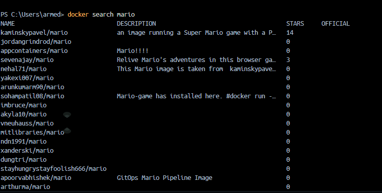

### 2. Télécharger l'image Mario

```bash
docker pull jordangrindrod/mario
```

> Télécharge l'image `jordangrindrod/mario` depuis Docker Hub vers la machine locale.

### 3. Vérifier que l'image est présente

```bash
docker images
```

> L'image `jordangrindrod/mario` doit maintenant apparaître dans la liste.

### 4. Lancer le conteneur Mario avec mapping de ports

```bash
docker run -itd -p 4545:8080 jordangrindrod/mario
```

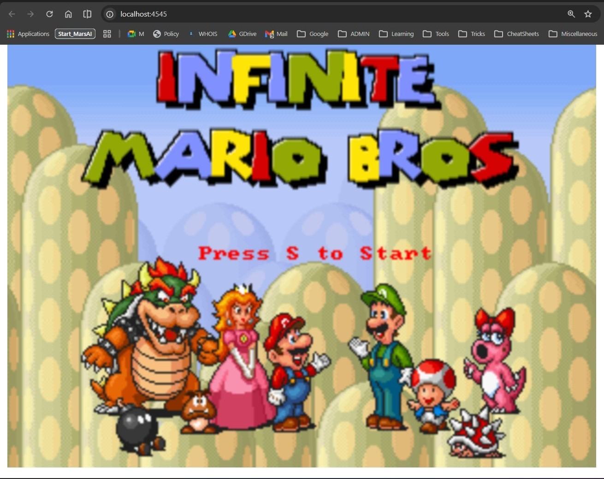

**Explications des options :**

- `-i` : mode interactif (interactive mode)
- `-t` : terminal
- `-d` : mode détaché (detach mode) - exécute le conteneur en arrière-plan
- `-p 4545:8080` : mappe le port 4545 de l'hôte au port 8080 du conteneur

> **Résultat :** Le conteneur démarre en arrière-plan et Mario est accessible à `http://localhost:4545`.
> 

### 5. Vérifier que le conteneur est en cours d'exécution

```bash
docker ps
```

> Affiche le conteneur Mario en cours d'exécution avec sa configuration.

### 6. Inspecter les détails du conteneur

```bash
docker inspect <container_id>
```

> Affiche tous les détails du conteneur correspondant à l'id renseigné, notamment les ports exposés et les configurations.

### 7. Accéder au jeu Mario

_Ouvrir un navigateur et aller à :_

```
http://localhost:4545
```


> Le jeu Mario est maintenant accessible et jouable dans le navigateur !

### 8. Arrêter le conteneur

```bash
docker stop <container_id>
```

> Arrête "gracieusement" le conteneur Mario (d'après son ID), sans le supprimer.

### 9. Supprimer le conteneur

```bash
docker rm <container_id>
```

> Supprime le conteneur (mais l'image reste disponible pour relancer).

---

## ✅ Résumé du job 03

| Étape            | Commande                                            | Résultat              |
| ---------------- | --------------------------------------------------- | --------------------- |
| Rechercher Mario | `docker search mario`                               | Images trouvées ✅    |
| Télécharger      | `docker pull jordangrindrod/mario`                  | Image récupérée ✅    |
| Vérifier images  | `docker images`                                     | Mario présent ✅      |
| Lancer conteneur | `docker run -itd -p 4545:8080 jordangrindrod/mario` | Conteneur démarré ✅  |
| Vérifier état    | `docker ps`                                         | Conteneur actif ✅    |
| Accéder au jeu   | `http://localhost:4545`                             | Mario jouable ✅      |
| Arrêter          | `docker stop <id>`                                  | Conteneur stoppé ✅   |
| Supprimer        | `docker rm <id>`                                    | Conteneur supprimé ✅ |

**Concepts clés :**

- Port mapping : `-p hostPort:containerPort`
- Mode interactif + terminal + détaché : `-itd`
- Docker Hub et les images publiques
- Gestion du cycle de vie d'un conteneur (run → stop → rm)

---

## Version alternative : Super Mario via Docker Desktop 👾

**Objectif :** Approfondir la manipulation des conteneurs Docker en utilisant **2 méthodes** : le terminal (CLI) et l'interface Docker Desktop (GUI). Cet exercice montre que Docker offre plusieurs interfaces pour gérer les conteneurs.

**Prérequis :** Job 01 et 02 complétés, Docker Desktop installé et ouvert.

**Image utilisée :** `pengbai/supermario` (port intérieur : 8080)

---

### PHASE 1 : Manipulation via TERMINAL (Méthode CLI)

#### **1. Rechercher l'image Super Mario**

```bash
docker search pengbai/supermario
```

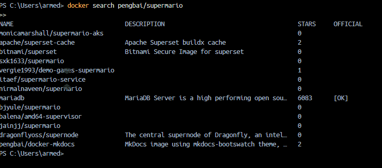

> Cette commande affiche toutes les images disponibles contenant "pengbai/supermario" dans Docker Hub. On cherche l'image officielle `pengbai/supermario`.
>
> **Résultat attendu :** Une liste d'images, la première étant `pengbai/supermario` (officielle).

---

#### **2. Télécharger l'image Super Mario**

```bash
docker pull pengbai/supermario
```

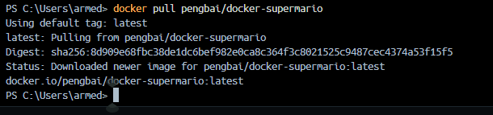

> Télécharge l'image `pengbai/supermario` depuis Docker Hub vers la machine locale.
>
> **Temps estimé :** 30 secondes à 2 minutes selon la vitesse internet.
>
> **Résultat :** Les couches (layers) de l'image sont téléchargées et extraites.

---

#### **3. Vérifier que l'image est présente**

```bash
docker images
```

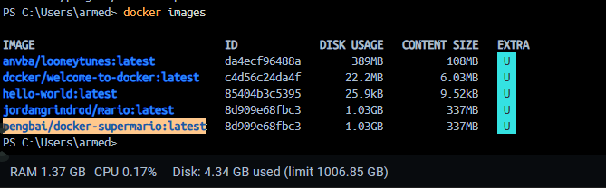

> Affiche la liste complète des images locales. L'image `pengbai/supermario` doit maintenant y apparaître.
>
> **Informations affichées :**
>
> - `REPOSITORY` : pengbai/supermario
> - `TAG` : latest
> - `IMAGE ID` : Identifiant unique de l'image
> - `SIZE` : Taille de l'image (généralement 150-200 MB)

---

#### **4. Lancer le 1er conteneur Super Mario (Port 8600)**

```bash
docker run -itd -p 8600:8080 pengbai/supermario
```

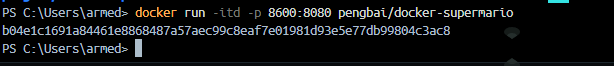

> **Options expliquées :**
>
> - `-i` : mode interactif (allows stdin/input)
> - `-t` : alloue un pseudo-terminal (tty)
> - `-d` : mode détaché (daemon) - exécute en arrière-plan
> - `-p 8600:8080` : mappe le port 8600 de la machine au port 8080 du conteneur
>
> **Résultat :** Un ID de conteneur est affiché (ex: `a1b2c3d4e5f6...`). Le conteneur démarre en arrière-plan.
>
> **Accès :** http://localhost:8600

---

#### **5. Lancer le 2e conteneur Super Mario (Port 8601)**

```bash
docker run -itd -p 8601:8080 pengbai/supermario
```

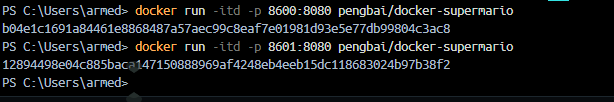

> Lance une **deuxième instance** du jeu Mario sur un port différent (8601).
>
> **Résultat :** Un 2e ID de conteneur est affiché.
>
> **Avantage :** Permet de tester plusieurs instances, ou qu'une personne joue sur chaque port.
>
> **Accès :** http://localhost:8601

---

#### **6. Vérifier les 2 conteneurs en cours d'exécution**

```bash
docker ps
```

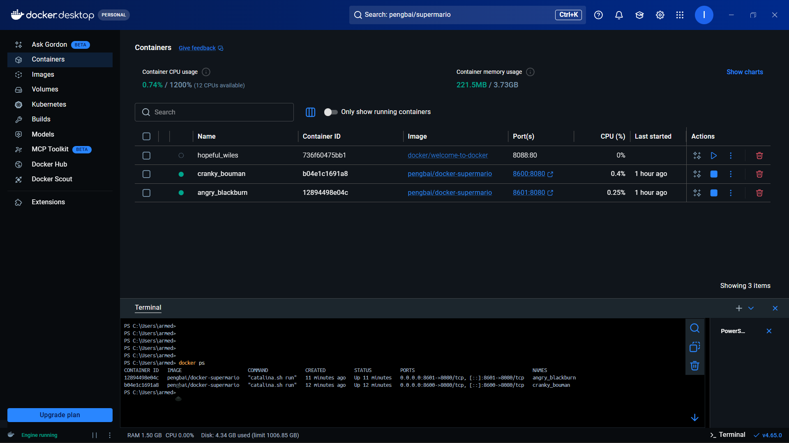

> Affiche les conteneurs actuellement actifs.
>
> **Résultat attendu :** 2 lignes, chacune avec :
>
> - `CONTAINER ID` : ID unique du conteneur
> - `IMAGE` : pengbai/supermario
> - `COMMAND` : Commande de démarrage
> - `CREATED` : Heure de création
> - `STATUS` : Up X minutes (en cours)
> - `PORTS` : **8600→8080** et **8601→8080** (les mapping visibles ici)
> - `NAMES` : Noms générés automatiquement (ex: `jolly_darwin`, `hopeful_babbage`)

---

#### **7. Accéder au jeu via le navigateur**

Ouvrez votre navigateur web et accédez à :

**Instance 1 :**

```
http://localhost:8601
```

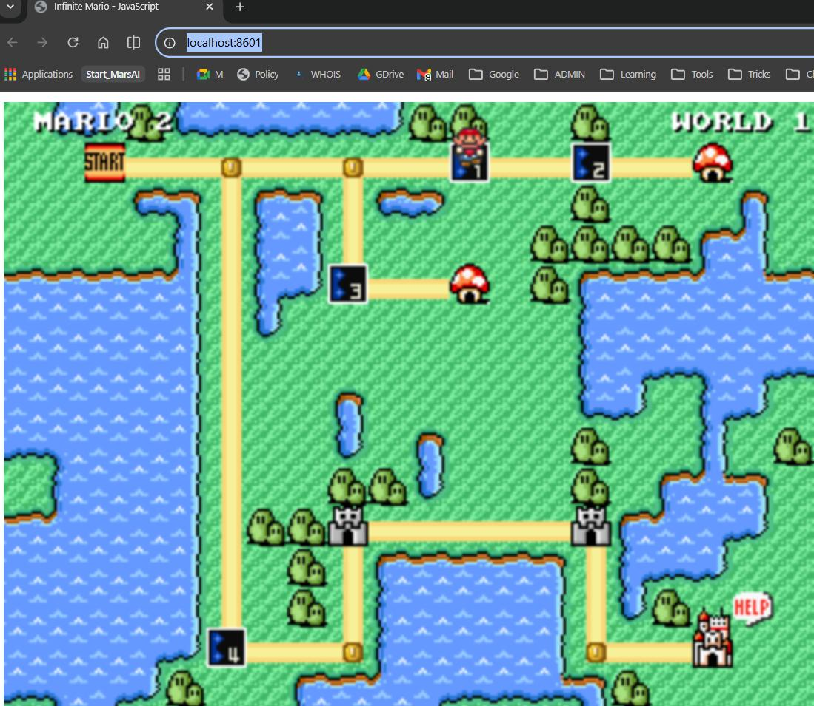

> Le jeu Super Mario démarre et est jouable !


**Instance 2 :**

```
http://localhost:8600
```


> Les deux instances fonctionnent indépendamment et peuvent être utilisées en parallèle.

**Vue des conteneurs actifs :**

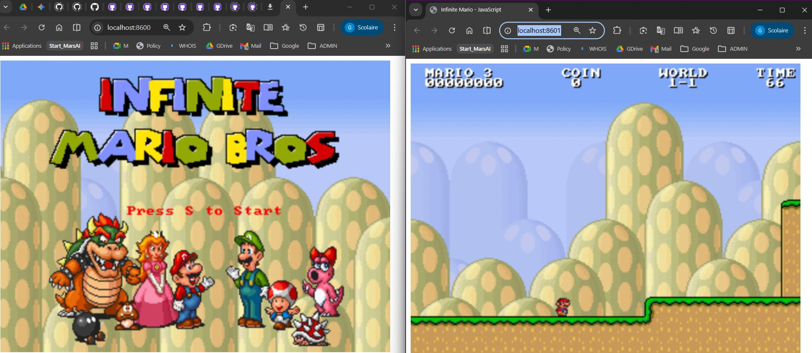

> Les deux conteneurs tournent simultanément (ports 8600 et 8601). La vérification se fait avec `docker ps`.

---

#### **8. Arrêter les conteneurs (Méthode : Par ID)**

**Arrêter le 1er conteneur :**

```bash
docker stop <container_id_1>
```

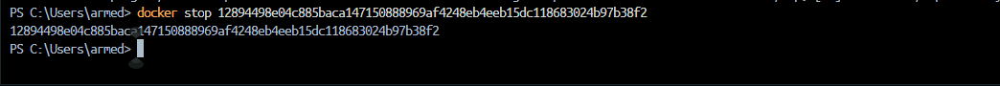

> Arrête gracieusement le conteneur (donne 10 secondes pour arrêter proprement).
>
> **Résultat :** L'ID du conteneur est affiché, confirmant l'arrêt.
>
> **Note :** L'utilisateur doit remplacer `<container_id_1>` par l'ID réel (ex: `a1b2c3d4e5f6`).

**Arrêter le 2e conteneur :**

```bash
docker stop <container_id_2>
```

> Arrête le 2e conteneur .
>
> **Alternative (arrêter tous les conteneurs) :**
>
> ```bash
> docker stop $(docker ps -q)
> ```

---

#### **9. Supprimer les conteneurs (Méthode 1 : Par ID)**

```bash
docker rm <container_id_1> <container_id_2>
```


> Supprime les 2 conteneurs. Les IDs doivent être séparés par des espaces.
>
> **Résultat :** Les IDs des conteneurs supprimés sont affichés.

---

#### **10. Supprimer l'image Super Mario**

```bash
docker rmi pengbai/supermario
```


> Supprime l'image `pengbai/supermario` du système local.
>
> **Résultat :** L'ID de l'image supprimée est affiché.
>
> **Attention :** L'image doit **ne pas être utilisée** par un conteneur (arrêté ou actif), sinon une erreur apparaît.

---

### PHASE 2 : Manipulation via DOCKER DESKTOP (Méthode GUI)

#### **Avantage de Docker Desktop**

- Son interface graphique intuitive
- La visualisation en temps réel des conteneurs et images
- La gestion "à la souris" (sans ligne de commande)
- Idéale pour les débutants

---

#### **1. Ouverture de Docker Desktop**

> Docker Desktop doit être en cours d'exécution. Chercher l'icône Docker dans la barre système (Windows : en bas à droite) ou lancer l'application.

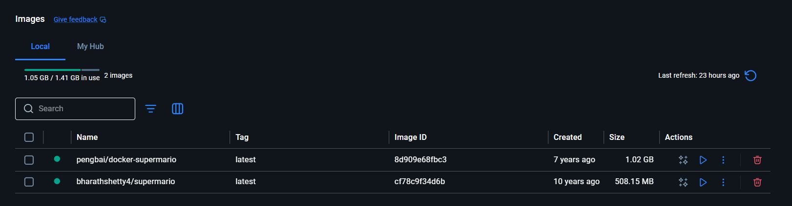

> Vue de l'onglet **Images**. L'image `pengbai/supermario` y apparaît.

---

#### **2. Naviguer vers l'onglet IMAGES**


> **Actions possibles :**
>
> - ✅ Voir toutes les images téléchargées
> - 🔍 Rechercher une image
> - ▶️ Lancer un conteneur depuis une image (bouton "RUN")
> - 🗑️ Supprimer une image

---

#### **3. Naviguer vers l'onglet CONTAINERS**


> **Informations affichées :**
>
> - Conteneurs en cours d'exécution
> - Statut (Running, Stopped, Exited)
> - Ports mappés (8600:8080, 8601:8080, etc.)
> - Options rapides (Stop, Delete, Open in browser, etc.)

**Avec 2 conteneurs en cours :**

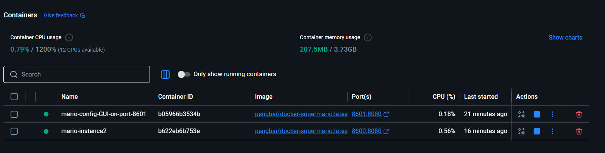

> Les 2 instances de Super Mario sont visibles côte à côte.

**Avec 3 conteneurs (variante) :**

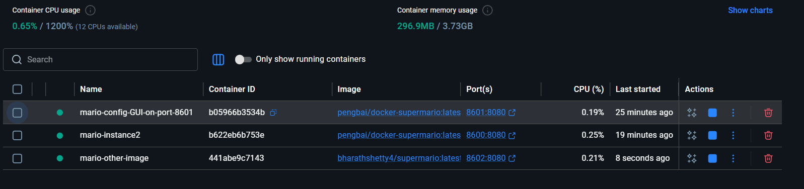

> Exemple avec 3 instances simultanées.

---

#### **4. Lancer un conteneur depuis Docker Desktop**

**Depuis l'onglet Images :**

1. Sélectionner `pengbai/supermario`
2. Cliquez sur le bouton **"RUN"** (triangle bleu ▶️)
3. Une fenêtre apparaît :
   - **Container name** : Donnez un nom (optionnel, ex: `mario-8600`)
   - **Ports** : Entrez `8600:8080` (ou `8601:8080` pour la 2e instance)
   - **Cliquez "RUN"**

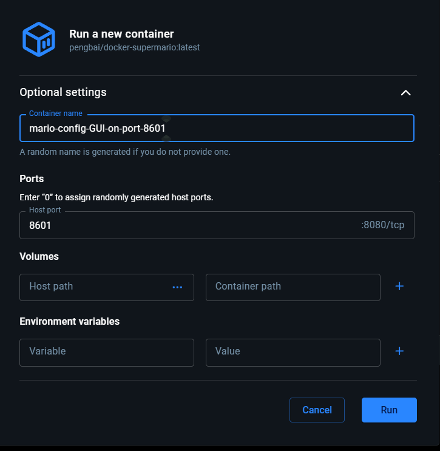

> Les conteneurs apparaissent immédiatement dans l'onglet **Containers**.

---

#### **5. Accéder au jeu depuis Docker Desktop**

**Depuis l'onglet Containers :**

1. Localisez le conteneur `pengbai/supermario`
2. Cliquez sur le port (ex: `8601:8080`)
3. **Automatiquement**, votre navigateur s'ouvre à http://localhost:8601

ou

Cliquez directement sur le **bouton "Open in browser"** (icône globe 🌐).


> Le jeu est accessible et jouable immédiatement.

---

#### **6. Arrêter un conteneur depuis Docker Desktop**

**Depuis l'onglet Containers :**

1. Localisez le conteneur
2. Cliquez sur le bouton **"STOP"** (icône ⏸️ ou carré rouge)


> Le statut devient **"Exited"** (arrêté).

Variante :

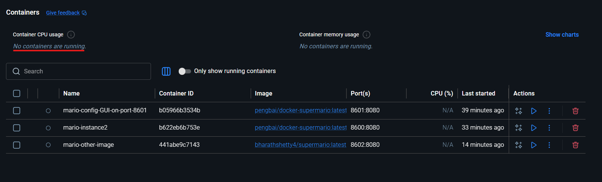

> L'interface peut afficher légèrement différemment, mais le fonctionnement est identique.

---

#### **7. Supprimer un conteneur depuis Docker Desktop**

**Depuis l'onglet Containers :**

1. Localisez le conteneur **arrêté**
2. Cliquez sur le bouton **"DELETE"** (icône 🗑️ ou croix rouge)
3. Confirmez la suppression

> Le conteneur disparaît de la liste.

---

#### **8. Supprimer une image depuis Docker Desktop**

**Depuis l'onglet Images :**

1. Localisez `pengbai/supermario`
2. Cliquez sur le bouton **"DELETE"** (icône 🗑️)
3. Confirmez

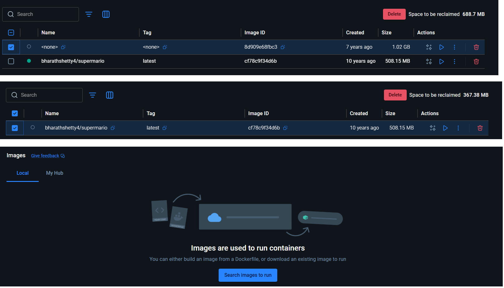

> L'image `pengbai/supermario` disparaît de la liste des images.

---

### PHASE 2 BONUS : Gestion avancée

#### **Renommer un conteneur via Docker Desktop**

Certaines versions permettent de cliquer sur le nom du conteneur pour le renommer (ex: `mario-8600` au lieu du nom généré).

---

#### **Afficher les détails au clic droit**

Clic droit sur un conteneur → **Inspect** : affiche toute la configuration (réseau, variable d'environnement, etc.).

---

#### **Événements en temps réel**

L'onglet **Dashboard** montre les événements en temps réel (démarrages, arrêts, suppressions).

---

### Résumé Job 03 - Comparaison des 2 Méthodes

| Action                  | Terminal (CLI)                     | Docker Desktop (GUI)                 |
| ----------------------- | ---------------------------------- | ------------------------------------ |
| **Rechercher image**    | `docker search pengbai/supermario` | Onglet "Images" → Recherche          |
| **Télécharger**         | `docker pull pengbai/supermario`   | Automatique lors du "RUN"            |
| **Lancer conteneur**    | `docker run -itd -p 8600:8080 ...` | Onglet "Images" → "RUN" + formulaire |
| **Vérifier état**       | `docker ps`                        | Onglet "Containers" (temps réel)     |
| **Accéder au jeu**      | http://localhost:8600              | Clic sur port ou "Open in browser"   |
| **Arrêter**             | `docker stop <id>`                 | Clic "STOP"                          |
| **Supprimer conteneur** | `docker rm <id>`                   | Clic "DELETE"                        |
| **Supprimer image**     | `docker rmi pengbai/supermario`    | Onglet "Images" → "DELETE"           |

---

### Concepts clés apprises (Job 03)

✅ **Port mapping** : Exposer plusieurs conteneurs sur des ports différents
✅ **Instances multiples** : Lancer plusieurs conteneurs de la même image
✅ **CLI vs GUI** : Deux interfaces pour le même résultat
✅ **Conteneurs responsables** : Chaque conteneur est isolé et indépendant
✅ **Docker Desktop professionnel** : Utilisation pratique pour développeurs
✅ **Gestion complète du cycle de vie** : pull → run → stop → rm → rmi

---

### ✅ Job 03 (alt.) - Résumé Tableau

| Étape                         | Commande / Action                  | Capture     | Résultat                      |
| ----------------------------- | ---------------------------------- | ----------- | ----------------------------- |
| **Rechercher (Terminal)**     | `docker search pengbai/supermario` | 12          | Images trouvées ✅            |
| **Télécharger**               | `docker pull pengbai/supermario`   | 13          | Image récupérée ✅            |
| **Vérifier image**            | `docker images`                    | 14          | penbaï/supermario présent ✅  |
| **Lancer 1er conteneur**      | `docker run -itd -p 8600:8080 ...` | 15          | Port 8600 ✅                  |
| **Lancer 2e conteneur**       | `docker run -itd -p 8601:8080 ...` | 16          | Port 8601 ✅                  |
| **Vérifier (Terminal)**       | `docker ps`                        | 17          | 2 conteneurs ✅               |
| **Vérifier (Desktop)**        | Onglet Containers                  | 17.1 / 17.2 | 2-3 conteneurs visibles ✅    |
| **Accéder au jeu (8600)**     | http://localhost:8600              | 20          | Mario jouable ✅              |
| **Accéder au jeu (8601)**     | http://localhost:8601              | 21          | Mario jouable ✅              |
| **Images (Desktop)**          | Onglet Images                      | 18          | pengbai/supermario visible ✅ |
| **Arrêter (Terminal)**        | `docker stop <id>`                 | 23          | Conteneur arrêté ✅           |
| **Arrêter (Desktop)**         | Clic "STOP"                        | 24 / 24.1   | Conteneur arrêté ✅           |
| **Supprimer par ID**          | `docker rm <container_id>`         | 25          | Conteneur supprimé ✅         |
| **Supprimer par nom**         | `docker rm <container_name>`       | 25.5        | Conteneur supprimé ✅         |
| **Vérifier suppression**      | `docker ps -a`                     | 25.6        | Aucun conteneur ✅            |
| **Supprimer image**           | `docker rmi pengbai/supermario`    | 26          | Image supprimée ✅            |
| **Image supprimée (Desktop)** | Onglet Images                      | 27          | pengbai/supermario absent ✅  |
