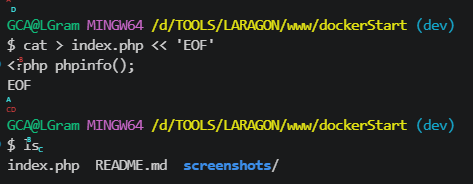
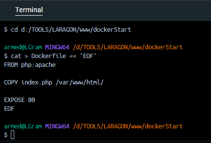
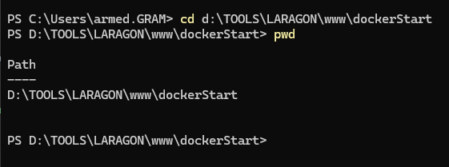
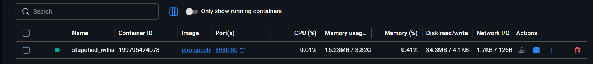
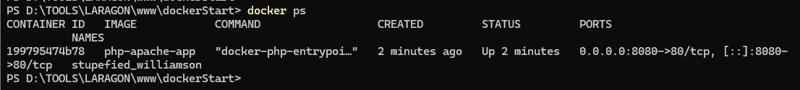
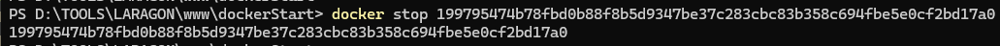

## Job 04 : Apache + PHP Info

**Objectif :** Créer une image Docker personnalisée contenant PHP, Apache, et un fichier `index.php` affichant les informations du serveur PHP via `phpinfo()`.

**Prérequis :** Job 01, 02, 03 complétés, Docker opérationnel.

**Concepts clés :** Dockerfile, images personnalisées, instructions COPY et EXPOSE, build d'image, port mapping.

---

### PHASE 1 : Préparation des fichiers source

#### 1. Créer le fichier `index.php`

**Commande :**

```bash
echo "<?php phpinfo(); ?>" > index.php
```

ou manuellement avec un éditeur de texte :

```php
<?php phpinfo(); ?>
```



> **Fichier créé :** `index.php` à la racine du projet `dockerStart/`
>
> **Explication :** `phpinfo()` est une fonction PHP qui affiche toutes les informations de configuration du serveur PHP (version installée, modules chargés, extensions, variables d'environnement, directive php.ini, etc.).

---

**Vérifier le contenu :**

```bash
cat index.php
```


> **Résultat :** Le fichier s'affiche dans le terminal avec le contenu `<?php phpinfo(); ?>`

---

#### 2. Créer le fichier `Dockerfile`

**Commande :**

```bash
cat > Dockerfile << 'EOF'
FROM php:apache

COPY index.php /var/www/html/

EXPOSE 80
EOF
```

ou manuellement avec un éditeur de texte :

```dockerfile
FROM php:apache

COPY index.php /var/www/html/

EXPOSE 80
```



> **Fichier créé :** `Dockerfile` (sans extension) à la racine du projet `dockerStart/`

---

**Vérifier le contenu :**

```bash
cat Dockerfile
```


> **Résultat :** Les 3 instructions du Dockerfile s'affichent dans le terminal.

---

**Explication des instructions Dockerfile :**

| Instruction                     | Explication                                                                                                                                |
| ------------------------------- | ------------------------------------------------------------------------------------------------------------------------------------------ |
| `FROM php:apache`               | Utilise l'image officielle `php:apache` comme base. Cette image contient PHP et Apache préinstallés.                                       |
| `COPY index.php /var/www/html/` | Copie le fichier `index.php` du système hôte vers le répertoire web du conteneur (`/var/www/html/`). Apache servira ce fichier par défaut. |
| `EXPOSE 80`                     | Documente que le conteneur écoute sur le port 80 (port standard d'Apache).                                                                 |

---

#### 3. Vérifier les fichiers créés

**Commande :**

```bash
ls -la
```


> **Résultat :** Les fichiers créés apparaissent :
>
> ```
> -rw-r--r--  ... index.php
> -rw-r--r--  ... Dockerfile
> -drwxr-xr-x  ... screenshots/
> ```

---

### Résumé Job 04 - Phase 1

| Étape | Commande                                 | Résultat                     |
| ----- | ---------------------------------------- | ---------------------------- |
| 1     | `echo "<?php phpinfo(); ?>" > index.php` | Fichier `index.php` créé ✅  |
| 2     | `cat index.php`                          | Contenu vérifié ✅           |
| 3     | `cat > Dockerfile << 'EOF'...`           | Fichier `Dockerfile` créé ✅ |
| 4     | `cat Dockerfile`                         | Contenu vérifié ✅           |
| 5     | `ls -la`                                 | 2 fichiers présents ✅       |

---

### PHASE 2 : Build et exécution

#### 1. Ouvrir un terminal dans le dossier du projet



> Assurez-vous d'être dans le répertoire `dockerStart/` qui contient les fichiers `index.php` et `Dockerfile`.

---

#### 2. Construire l'image Docker

**Commande :**

```bash
docker build -t php-apache-app .
```


> **Explication :**
>
> - `docker build` : construit une image Docker basée sur le Dockerfile
> - `-t php-apache-app` : assigne une étiquette (tag) à l'image (nom : `php-apache-app`, tag : `latest`)
> - `.` : utilise le Dockerfile dans le répertoire courant
>
> **Processus :**
>
> 1. Docker télécharge l'image `php:apache` depuis Docker Hub (première exécution seulement)
> 2. Crée une couche (layer) contenant Apache et PHP
> 3. Copie le fichier `index.php` dans `/var/www/html/`
> 4. Configure le port 80 comme exposé
>
> **Résultat :** `Successfully tagged docker.io/library/php-apache-app:latest`
>
> **Temps estimé :** 10-30 secondes (téléchargement) + extraction des couches.

---

#### 3. Vérifier que l'image a été créée

**Commande :**

```bash
docker images
```


> **Résultat :** L'image `php-apache-app` apparaît dans la liste avec :
>
> - `REPOSITORY` : `php-apache-app`
> - `TAG` : `latest`
> - `IMAGE ID` : ID unique de l'image
> - `SIZE` : Taille approximative (~450-500 MB)

---

#### 4. Lancer le conteneur

**Commande :**

```bash
docker run -d -p 8080:80 php-apache-app
```



> **Explication :**
>
> - `docker run` : crée et lance un nouveau conteneur basé sur l'image
> - `-d` : mode détaché (daemon) - exécute le conteneur en arrière-plan
> - `-p 8080:80` : mappe le port 8080 de la machine au port 80 du conteneur Apache
> - `php-apache-app` : l'image à utiliser pour créer le conteneur
>
> **Résultat :** Un ID de conteneur long s'affiche (ex: `a1b2c3d4e5f6...`). Le serveur Apache démarre automatiquement en arrière-plan.

---

#### 5. Vérifier que le conteneur est actif

**Commande :**

```bash
docker ps
```



> **Résultat :** Le conteneur apparaît avec :
>
> - `CONTAINER ID` : ID unique du conteneur
> - `IMAGE` : `php-apache-app`
> - `STATUS` : `Up X seconds` (conteneur actif)
> - `PORTS` : `0.0.0.0:8080->80/tcp` (port mapping en action)
> - `NAMES` : Nom généré automatiquement

---

#### 6. Accéder à la page phpinfo() dans le navigateur

**Ouvre un navigateur web et accède à :**

```
http://localhost:8080
```


> **Résultat attendu :** La page PHP d'information s'affiche avec :
>
> - **Titre de page :** `phpinfo()`
> - **PHP Version** : version installée (ex: PHP 8.2.0)
> - **Server API** : `Apache 2.0 Handler`
> - **System** : OS détecté (Linux, Windows, etc.)
> - **Build Date** : date de compilation PHP
> - **Modules PHP chargés** : liste des extensions (gd, curl, json, etc.)
> - **Variables d'environnement** : PATH, HOME, etc.
> - **Directive php.ini** : paramètres de configuration
>
> **Signification :** L'image personnalisée fonctionne correctement. Apache reçoit les requêtes HTTP sur le port 8080 et exécute le fichier PHP.

---

#### 7. Arrêter le conteneur

**Commande :**

```bash
docker stop <CONTAINER_ID>
```

**Exemple :**

```bash
docker stop a1b2c3d4e5f6
```



> **Résultat :** L'ID du conteneur s'affiche, confirmant l'arrêt gracieux.
>
> **Comportement :** Apache arrête de répondre. Le navigateur affichera "Impossible de se connecter" si vous essayez d'accéder à `http://localhost:8080`.

---

#### 8. Supprimer le conteneur

**Commande :**

```bash
docker rm <CONTAINER_ID>
```

**Exemple :**

```bash
docker rm a1b2c3d4e5f6
```


> **Résultat :** L'ID du conteneur s'affiche, confirmant la suppression.
>
> **Différence avec `docker stop` :**
>
> - `docker stop` : arrête le conteneur (ressources libérées, mais conteneur récupérable)
> - `docker rm` : supprime le conteneur définitivement (données perdues)

---

#### 9. Vérifier la suppression du conteneur

**Commande :**

```bash
docker ps -a
```


> **Résultat :** Le conteneur n'apparaît plus dans la liste (ni actif, ni arrêté).
>
> **Note :** Si d'autres conteneurs existent, seul le nôtre doit être absent.

---

### Résumé Job 04 - Phase 2 (Build & Run)

| Étape | Commande                                  | Screenshot | Résultat              |
| ----- | ----------------------------------------- | ---------- | --------------------- |
| 1     | Terminal dans dockerStart/                | 48         | Terminal prêt ✅      |
| 2     | `docker build -t php-apache-app .`        | 49         | Image construite ✅   |
| 3     | `docker images`                           | 50         | Image visible ✅      |
| 4     | `docker run -d -p 8080:80 php-apache-app` | 51         | Conteneur lancé ✅    |
| 5     | `docker ps`                               | 52         | Conteneur actif ✅    |
| 6     | http://localhost:8080                     | 53         | phpinfo() affichée ✅ |
| 7     | `docker stop <ID>`                        | 54         | Conteneur arrêté ✅   |
| 8     | `docker rm <ID>`                          | 55         | Conteneur supprimé ✅ |
| 9     | `docker ps -a`                            | 56         | Absence confirmée ✅  |

---

### Concepts clés apprises (Job 04)

✅ **Dockerfile personnalisé** : Créer une image basée sur une image officielle
✅ **Instructions Dockerfile** : FROM (image de base) → COPY (fichiers hôte) → EXPOSE (port)
✅ **Build d'image** : `docker build -t` pour compiler une image à partir d'un Dockerfile
✅ **Tag d'image** : Nommer et identifier les images avec `-t nom:tag`
✅ **Port mapping** : `-p hostPort:containerPort` pour exposer des services internes
✅ **Fonction phpinfo()** : Affiche la configuration complète du serveur PHP
✅ **Serveur Apache** : Déployer et tester un serveur web dans un conteneur
✅ **Cycle de vie complet** : build → run → tester → stop → rm

---

### ✅ Job 04 - Résumé final

**Objectif réalisé :** ✅ Image Docker personnalisée avec PHP, Apache et phpinfo()

1. **Créer des fichiers source** : `index.php` (code PHP) et `Dockerfile` (configuration)
2. **Construire une image personnalisée** : `docker build` en utilisant une image de base officielle
3. **Lancer un conteneur** : `docker run` avec mapping de port
4. **Tester l'application** : vérifier que PHP s'exécute correctement
5. **Nettoyer les ressources** : `docker stop` et `docker rm`

**Compétences acquises :** Création d'images Docker, gestion du cycle de vie des conteneurs, intégration d'applications web.

---

**Formation DWWM - La Plateforme** 🚀
