# Job 05 - Dockerfile Multi-stage Build 🐳

**Optimiser ses images Docker pour la production**

Formation DWWM - La Plateforme

---

## 📌 Objectif

Apprendre à créer des images Docker **ultra-légères** grâce au **multi-stage build**. Cette technique est utilisée en production pour réduire la taille des images de **75-80%** !

### ⚠️ Le Problème

Une image Node.js classique avec les `devDependencies` peut faire **400-600 MB**. En production, on n'a pas besoin de tout ça :

- node_modules complets (dev + prod)
- Code source TypeScript (avant compilation)
- Outils de build (tsc, ts-node, etc.)
- Fichiers temporaires

### ✨ La Solution : Multi-stage Build

On utilise **plusieurs FROM** pour séparer les étapes :

1. **Étape 1 : Builder** (image temporaire) - contient tout pour compiler
2. **Étape 2 : Production** (image finale) - contient UNIQUEMENT le nécessaire

---

## 🎯 Ce que tu vas apprendre

✅ Comprendre le problème des images trop lourdes  
✅ Utiliser plusieurs FROM dans un Dockerfile  
✅ Séparer le build de l'exécution avec `--from=builder`  
✅ Créer une image de production optimisée  
✅ Comparer les tailles et mesurer les gains (75-80% de réduction)

---

## 📁 Structure du Projet

```
Multistage/
├── src/
│   └── index.ts              # API TypeScript (Hello World)
├── package.json              # Dépendances Node.js
├── tsconfig.json             # Configuration TypeScript
├── Dockerfile                # Multi-stage (OPTIMISÉ)
├── Dockerfile-simple         # Classique (LOURD - pour comparaison)
├── dist/                     # Répertoire de build (généré)
├── node_modules/             # Dépendances Node (généré)
├── README.md                 # Cette documentation
└── screenshots/              # Captures d'écran des étapes
```

---

## 🛠️ ÉTAPE 1 : Initialiser le Projet

### 1.1 - Créer la structure initiale

**Commandes :**

```bash
cd d:\TOOLS\LARAGON\www\dockerStart
mkdir Multistage
cd Multistage
npm init -y
npm install express
npm install -D typescript ts-node @types/node @types/express
npx tsc --init
mkdir src
```

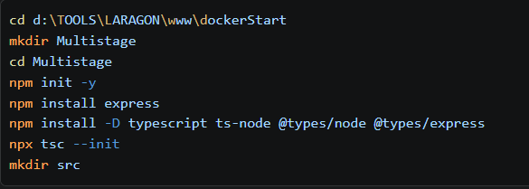

> **Résultat :** Les fichiers de base (`package.json`, `tsconfig.json`) sont créés automatiquement.

---

### 1.2 - Vérifier la structure

**Commande :**

```bash
dir
# ou
ls -la
```

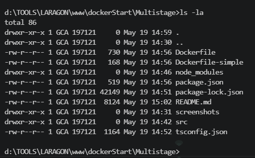

> **Contenu attendu :**
>
> - `package.json` : configuration npm
> - `tsconfig.json` : configuration TypeScript
> - `node_modules/` : dépendances installées
> - `src/` : dossier source (encore vide)

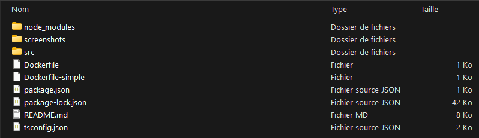

---

## 📄 ÉTAPE 2 : Créer les Fichiers Source

### 2.1 - Créer src/index.ts

**Contenu :**

```typescript
import express from "express";
import type { Request, Response } from "express";

const app = express();
const PORT = 3000;

app.get("/", (req: Request, res: Response) => {
  res.send("Hello World from TypeScript API!");
});

app.listen(PORT, () => {
  console.log(`Server running on port ${PORT}`);
});
```

> **Explication :**
>
> - Import d'Express et des types TypeScript
> - Création d'une API simple qui répond "Hello World"
> - Écoute sur le port 3000

---

### 2.2 - Vérifier package.json

**Contenu :**

```json
{
  "name": "api-multistage",
  "version": "1.0.0",
  "description": "TypeScript API with multistage build",
  "main": "dist/index.js",
  "scripts": {
    "build": "tsc",
    "start": "node dist/index.js",
    "dev": "ts-node src/index.ts"
  },
  "keywords": [],
  "author": "",
  "license": "ISC",
  "dependencies": {
    "express": "^4.22.2"
  },
  "devDependencies": {
    "@types/express": "^4.17.25",
    "@types/node": "^20.19.41",
    "ts-node": "^10.9.2",
    "typescript": "^5.9.3"
  },
  "type": "module"
}
```

> **Scripts importants :**
>
> - `build` : compile TypeScript en JavaScript (tsc)
> - `start` : lance l'API depuis le répertoire dist/
> - `dev` : lance l'API en développement avec ts-node

---

### 2.3 - Tester la compilation

**Commande :**

```bash
npm run build
```

> **Résultat :**
>
> - Le dossier `dist/` est créé automatiquement
> - Contient `index.js` (version compilée)

---

## 🐳 ÉTAPE 3 : Créer les Dockerfiles

### 3.1 - Dockerfile-simple (CLASSIQUE - LOURD ⚠️)

**Contenu :**

```dockerfile
FROM node:18

WORKDIR /app

COPY package*.json ./

RUN npm install

COPY src ./src
COPY tsconfig.json .

RUN npm run build

EXPOSE 3000

CMD ["node", "dist/index.js"]
```

**Problèmes de cette approche :**

❌ Utilise l'image complète `node:18` (~900 MB)
❌ Conserve TOUS les node_modules (dev + prod)
❌ Conserve les outils de build (tsc, ts-node, etc.)
❌ Conserve le code TypeScript source
❌ **Taille finale : 400-600 MB** 📦

---

### 3.2 - Dockerfile (MULTI-STAGE - OPTIMISÉ ✨)

**Contenu :**

```dockerfile
# ====================================
# ÉTAPE 1 : BUILD (image temporaire)
# ====================================
FROM node:18-alpine AS builder

WORKDIR /app

COPY package*.json ./

RUN npm install

COPY src ./src
COPY tsconfig.json .

RUN npm run build

# ====================================
# ÉTAPE 2 : PRODUCTION (image finale)
# ====================================
FROM node:18-alpine AS production

WORKDIR /app

# Copier UNIQUEMENT le build depuis l'étape builder
COPY --from=builder /app/dist ./dist
COPY --from=builder /app/package*.json ./

# Installer SEULEMENT les dépendances de production
RUN npm install --production

# Utilisateur non-root (sécurité)
USER node

EXPOSE 3000

CMD ["node", "dist/index.js"]
```

**Optimisations appliquées :**

✅ `alpine` au lieu de versions complètes (image de base : ~150 MB au lieu de 900 MB)
✅ Stage `builder` : contient tout pour compiler, puis est jeté
✅ Stage `production` : ne copie que le build compilé (`dist/`)
✅ `npm install --production` : sans devDependencies
✅ `USER node` : sécurité (pas d'exécution en tant que root)
✅ **Taille finale : 100-150 MB** 📦 → **75-80% de réduction !**

**Explications clés :**

| Instruction                    | Signification                                  |
| ------------------------------ | ---------------------------------------------- |
| `FROM ... AS builder`          | Crée une étape nommée "builder"                |
| `FROM ... AS production`       | Crée l'étape finale de production              |
| `COPY --from=builder`          | Copie des fichiers depuis une étape antérieure |
| `RUN npm install --production` | N'installe que les dépendances en production   |

---

## 🚀 ÉTAPE 4 : Builder les Images

### 4.1 - Build l'image CLASSIQUE

**Commande :**

```bash
docker build -f Dockerfile-simple -t api-simple .
```

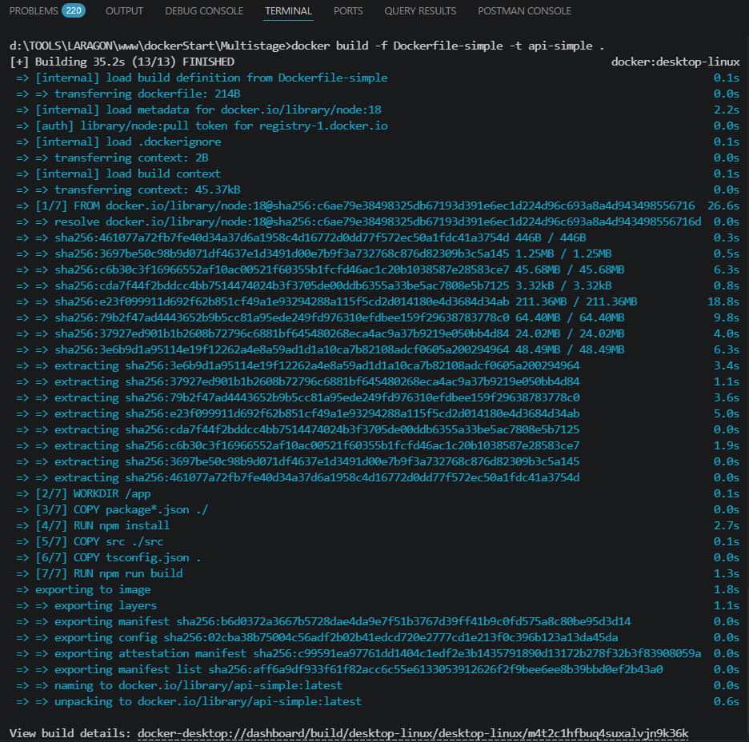

> **Processus :**
>
> 1. Télécharge l'image `node:18` (~900 MB)
> 2. Installe les dépendances (`npm install`)
> 3. Copie le code source
> 4. Compile le TypeScript
> 5. Finalise l'image

**Temps estimé :** 30-60 secondes (selon la connexion Internet)

---

### 4.2 - Visualiser la build (Desktop) - Variante 1

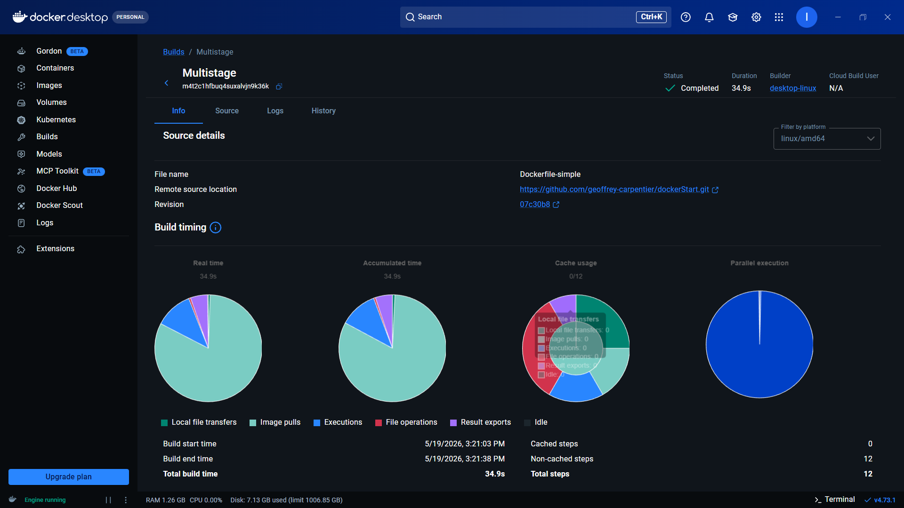

> **Vue en temps réel du processus de build** via Docker Desktop, montrant :
>
> - L'image de base en cours de téléchargement
> - Les couches (layers) en construction

---

### 4.3 - Visualiser la build (Desktop) - Variante 2

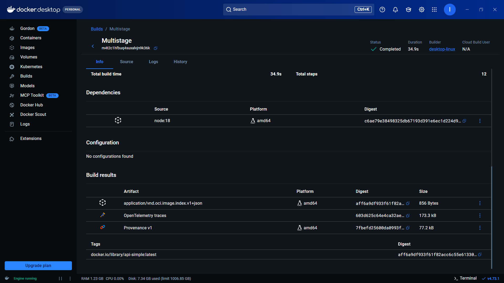

> **Progression de la compilation**, étape par étape.

---

### 4.4 - Build l'image MULTI-STAGE

**Commande :**

```bash
docker build -f Dockerfile -t api-prod .
```

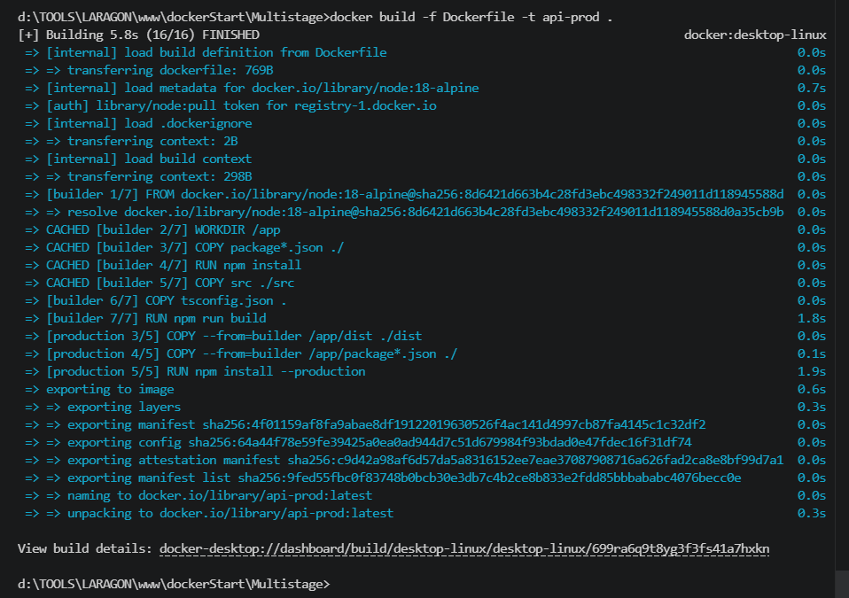

> **Processus :**
>
> 1. **Étape 1 (builder) :**
>    - Télécharge `node:18-alpine` (~150 MB)
>    - Installe toutes les dépendances
>    - Compile le TypeScript
> 2. **Étape 2 (production) :**
>    - Crée une nouvelle image `node:18-alpine`
>    - Copie UNIQUEMENT `dist/` et `package*.json`
>    - Installe SEULEMENT les dépendances de production
>    - L'image builder est automatiquement jetée ✨

**Temps estimé :** 20-40 secondes

---

### 4.5 - Visualiser la build multi-stage (Desktop) - Variante 1

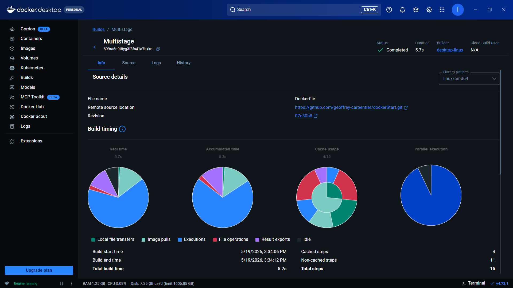

> **Processus de construction avec ses deux étapes**, visibles dans Docker Desktop.

---

### 4.6 - Visualiser la build multi-stage (Desktop) - Variante 2

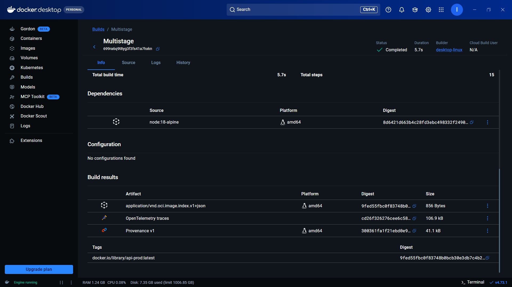

> **Vue progressive de la build**, montrant comment les deux étapes fonctionnent en parallèle.

---

## 📊 ÉTAPE 5 : Comparer les Tailles

### Commande :

```bash
docker images
```

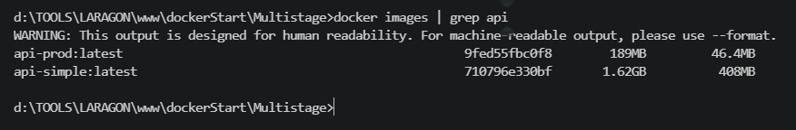

### Résultat attendu :

| Image        | Taille         | Type        | Réduction       |
| ------------ | -------------- | ----------- | --------------- |
| `api-simple` | **400-600 MB** | Classique   | 100% (baseline) |
| `api-prod`   | **100-150 MB** | Multi-stage | **75-80%** ✨   |

### 🎯 Gain obtenu :

```
Économie = 400-600 MB - 100-150 MB = 250-500 MB sauvegardés !
Réduction = (250-500 / 400-600) × 100 = 75-80%
```

**En production :**

- ✅ Déploiements plus rapides (moins de données à télécharger)
- ✅ Images plus légères (économies de stockage)
- ✅ Conteneurs plus rapides à démarrer
- ✅ Réduction de la surface d'attaque (moins de code inutile)

---

## ✅ ÉTAPE 6 : Tester les Images

### 6.1 - Lancer l'image CLASSIQUE

**Commande :**

```bash
docker run -d -p 3001:3000 --name api-simple-container api-simple
```

> **Options :**
>
> - `-d` : détaché (background)
> - `-p 3001:3000` : mappe le port 3001 (hôte) → 3000 (conteneur)
> - `--name api-simple-container` : nomme le conteneur

**Accès :** Ouvrez votre navigateur à `http://localhost:3001`


> **Résultat :** La page affiche "Hello World from TypeScript API!"
>
> ✅ L'image classique fonctionne, mais elle contient beaucoup de code inutile en production.

---

### 6.2 - Lancer l'image MULTI-STAGE

**Commande :**

```bash
docker run -d -p 3002:3000 --name api-prod-container api-prod
```

**Accès :** Ouvrez votre navigateur à `http://localhost:3002`

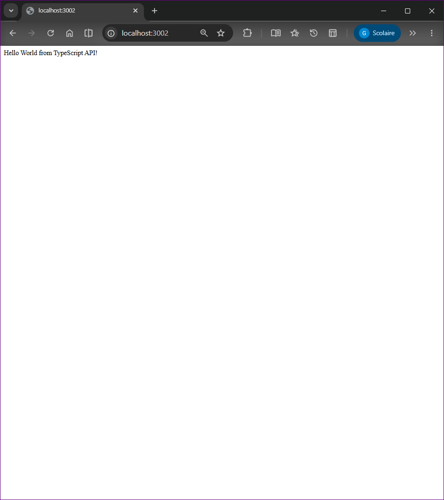

> **Résultat :** La page affiche le même "Hello World from TypeScript API!"
>
> ✅ L'image optimisée fonctionne **identiquement**, mais elle est **75-80% plus légère** !

---

### 6.3 - Tester les 2 en parallèle

**Ouvrez les 2 URLs dans des onglets :**

- **Port 3001 (classique):** http://localhost:3001
- **Port 3002 (multi-stage):** http://localhost:3002

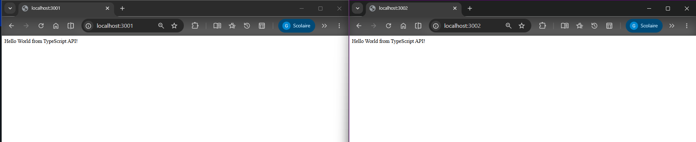

> **Constat :**
>
> - Les deux produisent le même résultat fonctionnel
> - L'image classique = **400-600 MB** (lourd)
> - L'image optimisée = **100-150 MB** (léger)
> - **Aucune différence perceptible pour l'utilisateur** ✨

---

## 🧹 ÉTAPE 7 : Nettoyage

### 7.1 - Arrêter les conteneurs

```bash
docker stop api-simple-container api-prod-container
```

> Arrête les deux conteneurs gracieusement.

---

### 7.2 - Supprimer les conteneurs

```bash
docker rm api-simple-container api-prod-container
```

> Supprime les conteneurs définitivement.

---

### 7.3 - Vérifier la suppression

```bash
docker ps -a
```

> Les deux conteneurs ne doivent plus apparaître.

---

### 7.4 - Supprimer les images (optionnel)

```bash
docker rmi api-simple api-prod
```

> Supprime les images du système local.

---

## 📝 Résumé des Commandes Clés

```bash
# ========== INITIALISATION ==========
npm init -y
npm install express
npm install -D typescript ts-node @types/node @types/express
npx tsc --init
mkdir src

# ========== BUILD ==========
# Image classique (LOURDE)
docker build -f Dockerfile-simple -t api-simple .

# Image multi-stage (OPTIMISÉE)
docker build -f Dockerfile -t api-prod .

# ========== VÉRIFICATION ==========
docker images                          # Voir les tailles

# ========== EXÉCUTION ==========
# Lancer l'image classique
docker run -d -p 3001:3000 --name api-simple-container api-simple

# Lancer l'image multi-stage
docker run -d -p 3002:3000 --name api-prod-container api-prod

# ========== TEST ==========
# Navigateur : http://localhost:3001 (classique)
# Navigateur : http://localhost:3002 (multi-stage)

# ========== NETTOYAGE ==========
docker stop api-simple-container api-prod-container
docker rm api-simple-container api-prod-container
docker rmi api-simple api-prod
```

---

## 💡 Points Clés à Retenir

### 1️⃣ Multi-stage Build = 2+ FROM

```dockerfile
FROM node:18-alpine AS builder     # Étape 1 : temporaire
FROM node:18-alpine AS production  # Étape 2 : finale
```

### 2️⃣ COPY --from=builder

Copie les artefacts d'une étape antérieure vers la nouvelle :

```dockerfile
COPY --from=builder /app/dist ./dist
```

### 3️⃣ alpine = Ultra-léger

- `node:18` = 900+ MB
- `node:18-alpine` = 150 MB
- **Différence : 750 MB !**

### 4️⃣ npm install --production

En production, n'installer que les dépendances nécessaires (pas tsc, ts-node, etc.) :

```dockerfile
RUN npm install --production
```

### 5️⃣ USER node = Sécurité

Éviter d'exécuter en tant que root :

```dockerfile
USER node
```

---

## 🎓 Concepts Appris

✅ **Problème des images trop lourdes** - Pourquoi optimiser  
✅ **Concept du multi-stage build** - Séparer les étapes  
✅ **Optimisation avec alpine** - Réduire la taille de base  
✅ **Séparation build/production** - Build vs runtime  
✅ **Mesure et comparaison** - Quantifier les gains (75-80%)  
✅ **Sécurité avec USER** - Éviter root en production  
✅ **Tests fonctionnels** - Vérifier l'équivalence des deux versions

---

## 📌 État du Job 05

✅ API TypeScript créée  
✅ Dockerfile classique créé et testé  
✅ Dockerfile multi-stage créé et testé  
✅ Images buildées et comparées  
✅ Tests fonctionnels complétés  
✅ Screenshots intégrés à la documentation  
✅ Documentation cohérente et complète

---

## 🚀 Résumé : Avant vs Après

### Image Classique (Dockerfile-simple)

```
FROM node:18                    → Image lourde (~900 MB)
COPY package*.json              → Toutes les dépendances
RUN npm install                 → Dev + prod
COPY src ./src                  → Code source inutile
RUN npm run build               → Outils de build conservés
EXPOSE 3000
CMD [...]
```

**Résultat : 400-600 MB** ❌

---

### Image Optimisée (Dockerfile multi-stage)

```
# ÉTAPE 1 : BUILDER
FROM node:18-alpine AS builder  → Image légère (~150 MB)
COPY package*.json
RUN npm install
COPY src ./src
RUN npm run build               → Compilation effectuée ici
→ IMAGE TEMPORAIRE JETÉE

# ÉTAPE 2 : PRODUCTION
FROM node:18-alpine             → Nouvelle image légère
COPY --from=builder /app/dist   → UNIQUEMENT le build
RUN npm install --production    → Dépendances de prod uniquement
USER node                       → Sécurité
EXPOSE 3000
CMD [...]
```

**Résultat : 100-150 MB** ✅ (**75-80% de réduction !**)

---

**Formation DWWM - La Plateforme** 🚀
