# Job 05 - Tic Tac Toe : Docker et volumes 🎮

**Formation Docker - La Plateforme DWWM**

## Objectif général

Créer une application Tic Tac Toe dockerisée avec persistance des résultats via un volume Docker nommé `game-results`.

## Compétences visées

- Créer et exploiter une image Docker
- Utiliser les volumes Docker pour la persistance
- Configurer Nginx + PHP dans Docker
- Mapper des ports et des volumes

## Vue d'ensemble

| Aspect          | Détail                                   |
| --------------- | ---------------------------------------- |
| Image Docker    | `trafex/php-nginx:latest`                |
| Port exposé     | `8080`                                   |
| Volume          | `game-results`                           |
| Fichiers servis | `index.html`, `save.php`, `results.json` |
| Backend         | `save.php`                               |

## Remarques importantes

- L'image de base `trafex/php-nginx:latest` écoute en interne sur le port `8080` et gère Nginx/PHP via son mécanisme interne. Ne changez pas le port interne sauf besoin avancé.
- Quand vous montez un **volume nommé Docker** (ex. `game-results`) sur `/var/www/html`, Docker copie automatiquement le contenu initial de l'image vers le volume au premier démarrage. Ainsi, monter le volume nommé **ne masque pas** les fichiers fournis par l'image — ils sont copiés dans le volume.

## Structure du projet

```text
Tic_Tac_Toe/
├── Dockerfile
├── index.html
├── save.php
├── results.json
├── screenshots/
```

## Étape 1 - Vérifier la structure du projet

```bash
cd Tic_Tac_Toe
ls -la
```

**Résultat attendu :**

- `index.html` pour l'interface du jeu
- `save.php` pour la sauvegarde des résultats
- `results.json` pour la persistance
- `Dockerfile` pour la construction de l'image

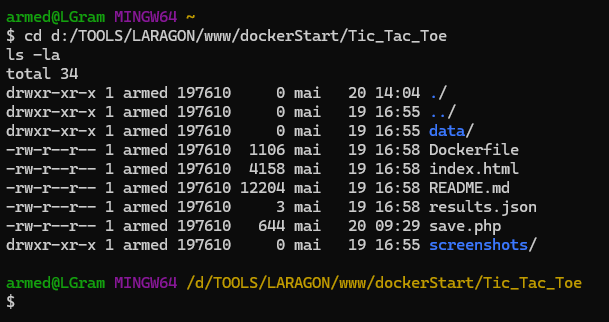

## Étape 2 - Vérifier le Dockerfile

```bash
cat Dockerfile
```

**Points importants :**

- image de base `trafex/php-nginx:latest`
- copie des fichiers du jeu dans `/var/www/html`
- ajustement des droits sur `results.json`
- exposition du port `8080`

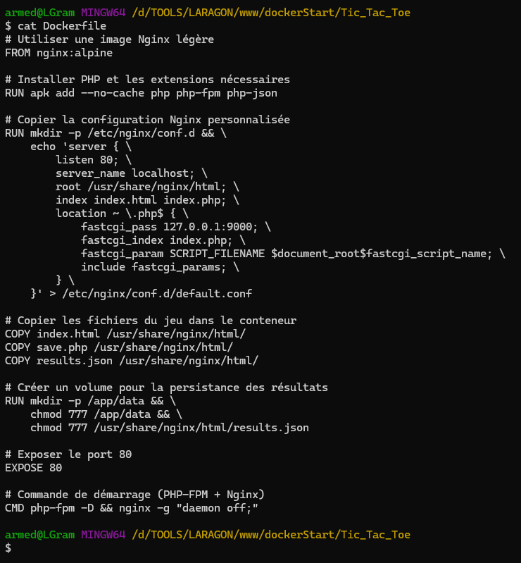

## Étape 3 - Construire l'image Docker

```bash
docker build -t tic-tac-toe-app .
```

**Résultat :** l'image `tic-tac-toe-app` est créée avec succès.

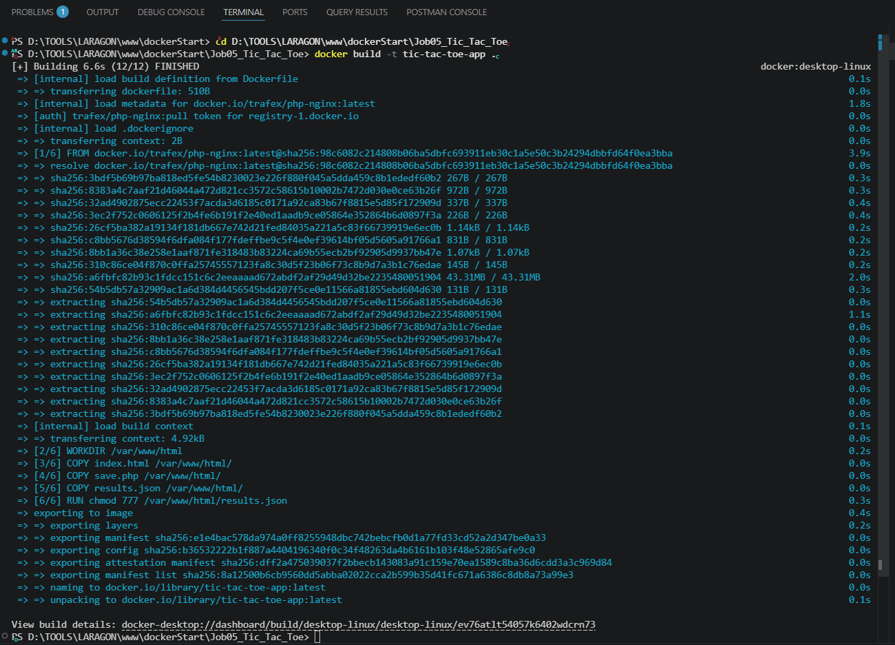

On peut accèder aux détails de l'image créée dans docker desktop :

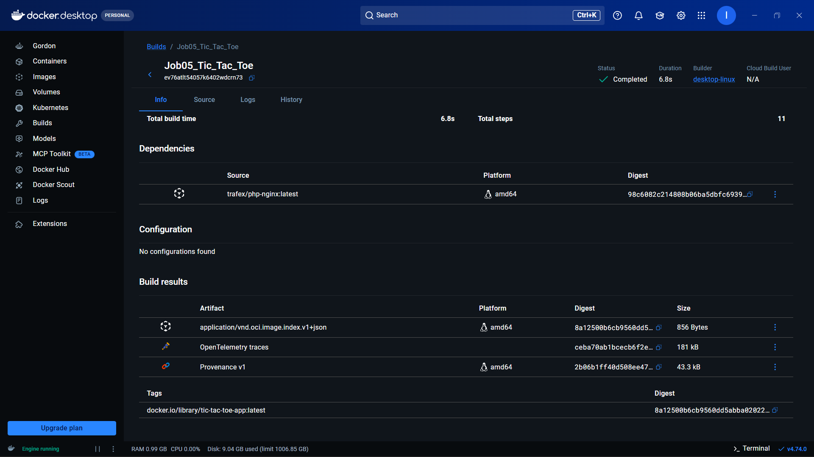

## Étape 4 - Vérifier l'image créée

```bash
docker images
```

**Résultat :** l'image `tic-tac-toe-app` apparaît dans la liste.

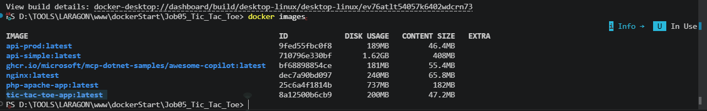

## Étape 5 - Créer le volume Docker

```bash
docker volume create game-results
```

**Résultat :** le volume nommé `game-results` est créé.

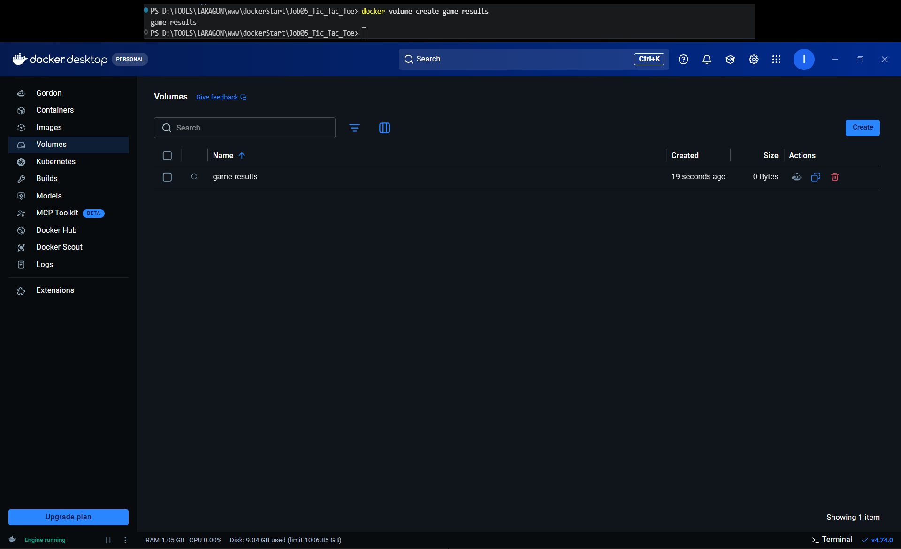

## Étape 6 - Vérifier et inspecter le volume

```bash
docker volume ls
docker volume inspect game-results
```

**Résultat :** le volume est bien présent et son emplacement est accessible.

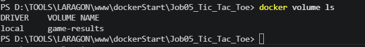

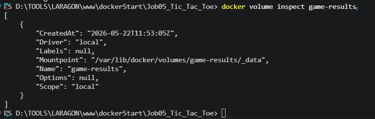

## Étape 7 - Lancer le conteneur

```bash
docker run -d -p 8080:8080 -v game-results:/var/www/html --name tic-tac-toe-container tic-tac-toe-app
```

**Explications :**

- `-d` : exécution en arrière-plan
- `-p 8080:8080` : port de l'hôte vers le port du conteneur
- `-v game-results:/var/www/html` : montage du volume sur le répertoire web
- `--name tic-tac-toe-container` : nom explicite du conteneur

**Accès :** `http://localhost:8080`

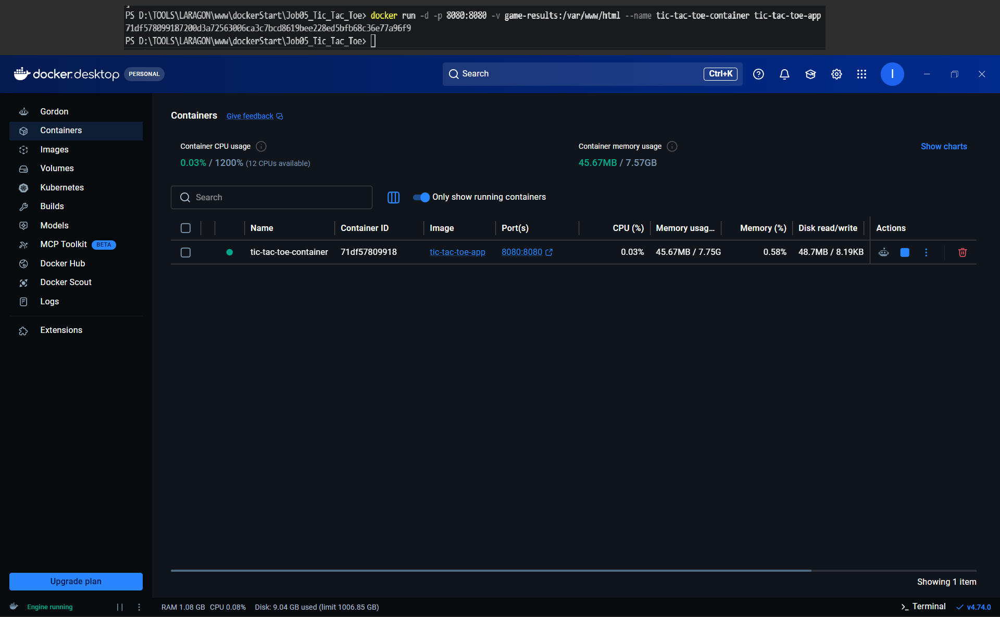

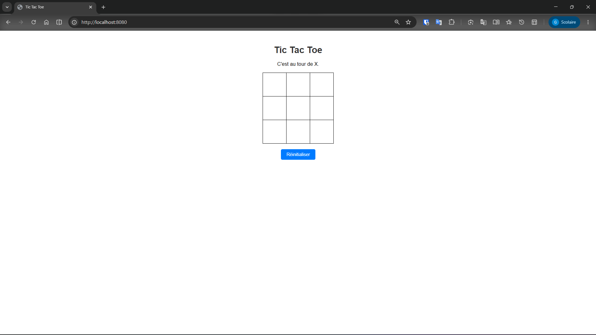

## Étape 8 - Vérifier le fonctionnement

```bash
docker ps
docker logs tic-tac-toe-container
```

**Résultat :** le conteneur tourne correctement et PHP-FPM / Nginx démarrent sans erreur.

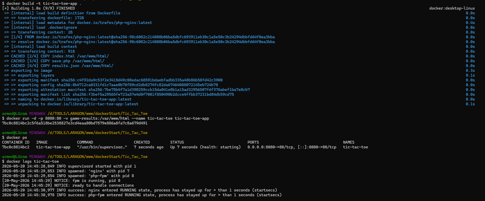

## Étape 9 - Vérifier la persistance des résultats

```bash
docker exec tic-tac-toe-container cat /var/www/html/results.json
```

**Résultat :** le fichier `results.json` contient les parties enregistrées.

> Le volume `game-results` conserve les fichiers, même si le conteneur est supprimé.

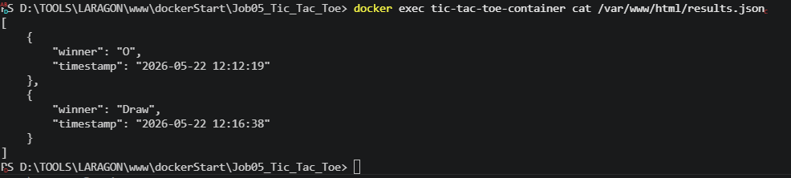

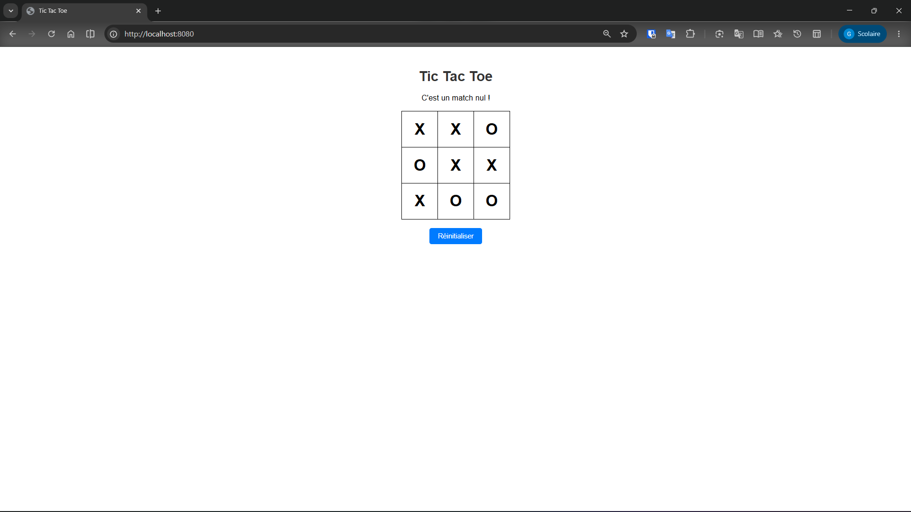

## Étape 10 - Arrêter, supprimer et vérifier le nettoyage

```bash
docker stop tic-tac-toe-container
docker rm tic-tac-toe-container
docker rmi tic-tac-toe-app
docker ps -a
```

**Résultat :** le conteneur et l'image sont supprimés, mais le volume reste disponible.

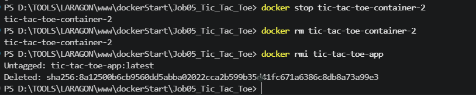

## Vérification finale du volume

Le volume `game-results` contient bien les fichiers attendus :

- `index.html`
- `save.php`
- `results.json`

Cette vue confirme que la persistance fonctionne correctement dans Docker Desktop.

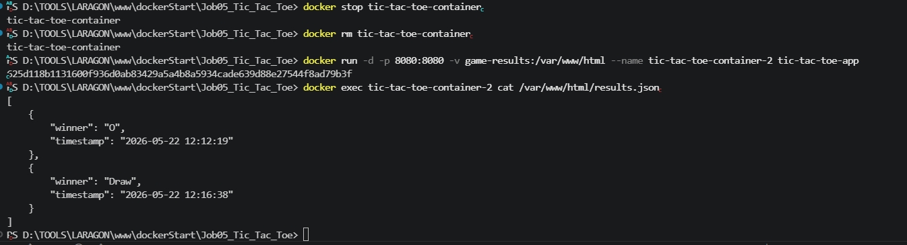

## Résumé final

- Image Docker créée avec succès
- Volume nommé `game-results` créé et utilisé
- Application accessible via `http://localhost:8080`
- Résultats stockés dans `results.json`
- Persistance validée après arrêt du conteneur

**Formation Docker - La Plateforme DWWM** 🚀
