# Docker - Plateforme DWWM

## Job 01 : Welcome to Docker & Commandes de base

**Objectif :** Préparer l'environnement et manipuler les commandes fondamentales.
**Prérequis :** Avoir Docker installé et en cours d'exécution.

¤ [Lien du fichier d'installation](https://docs.docker.com/desktop/install/windows-install/)
¤ [Lien de la documentation](https://docs.docker.com/reference/)

Puis dans Visual-studio ou dans terminal (cmd, powershell...) on va taper les commandes de base pour vérifier que Docker est bien installé et opérationnel.

### 1. Vérification de l'installation

_Pour s'assurer que Docker est bien installé et opérationnel, on vérifie la version :_

```bash
docker --version
# ou docker -v
```


> version **29.2.1** => **docker** est bien installé

### 2. Informations système

```bash
docker info
```

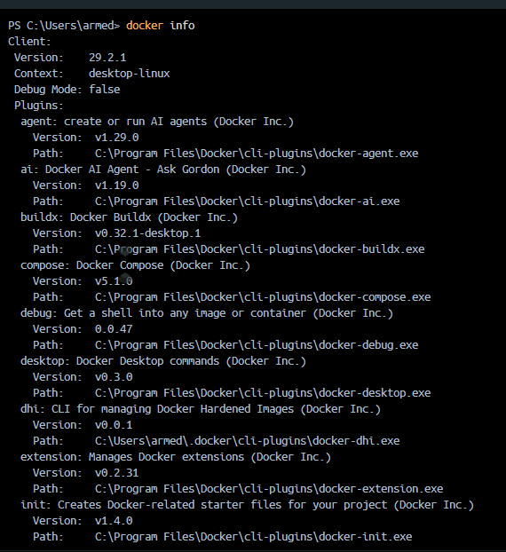

> **info** permet d'afficher toutes les infos du système Docker (Conteneurs, Images, etc.)

---

## Test des commandes de base

### 3. Vérifier les conteneurs en cours d'exécution

```bash
docker ps
```

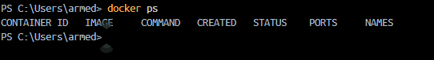

> Affiche les conteneurs actuellement actifs. Aucun au départ.

### 4. Lister les images disponibles localement

```bash
docker images
```

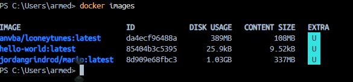

> Montre les images Docker présentes sur la machine.

### 5. Lancer le conteneur "Welcome to Docker"

```bash
docker run -it --rm -p 8088:80 docker/welcome-to-docker
```

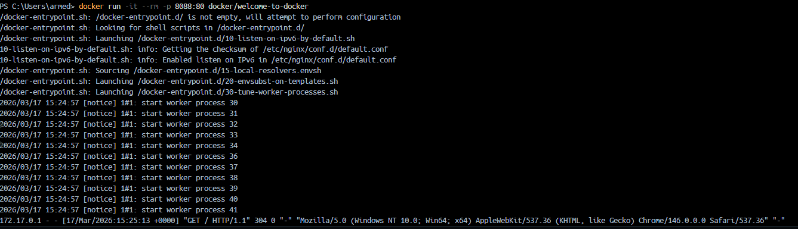

> Lance un conteneur en mode interactif (-it), expose le port 8088 de la machine vers le port 80 du conteneur, et supprime le conteneur automatiquement à l'arrêt (--rm).
>
> **Résultat :** Accès à http://localhost:8088 dans un navigateur
> ***Notes :***
>- Le conteneur doit être arrêté manuellement (CTRL+C) pour revenir au terminal.
>-  Pour faire tourner le conteneur en arrière-plan, utiliser `-d` (détaché) et entrer `docker stop <id>` pour l'arrêter ensuite:
> `docker run -d -p 8088:80 docker/welcome-to-docker`
> puis
>  `docker stop <id>` pour arrêter.
>- Les options `-it` et `-d` peuvent être combinées pour lancer en mode interactif et détaché (mais il faut alors gérer les logs pour voir la sortie du conteneur).

### 6. Arrêter le conteneur

```bash
docker stop <container_id|container_name>
```

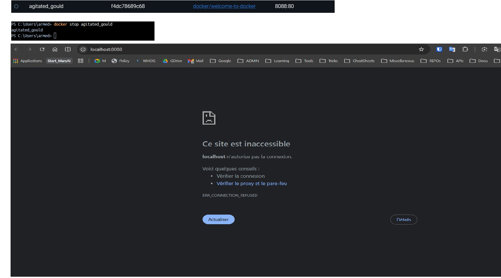

> Arrête "gracieusement" le conteneur (sans le supprimer).

### 7. Télécharger l'image hello-world

```bash
docker pull hello-world
```

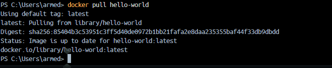

> Télécharge l'image "hello-world" depuis Docker Hub vers la machine locale.

### 8. Vérifier que l'image est bien présente

```bash
docker images
```

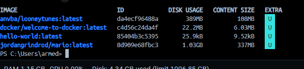

> Hello-world doit maintenant apparaître dans la liste des images locales.

### 9. Lancer le conteneur hello-world

```bash
docker run --rm hello-world
```


> Lance le conteneur hello-world. L'option --rm supprime automatiquement le conteneur après son exécution.
>
> **Résultat :** Affiche un message de bienvenue et s'arrête.

### 10. Actions de suppression - Guide complet

#### **A. Supprimer des CONTENEURS**

**1️⃣ Supprimer un conteneur spécifique** (connu par son ID ou nom)

```bash
# Par ID (avec les premiers caractères)
docker rm a1b2c3d4e5f6

# Par nom complet
docker rm mon-conteneur
```

> ✅ Le conteneur doit être **arrêté** avant la suppression. S'il est actif, un message d'erreur apparaît.

---

**2️⃣ Supprimer plusieurs conteneurs spécifiques**

```bash
# Par IDs
docker rm a1b2c3d4e5f6 g7h8i9j0k1l2

# Par noms
docker rm conteneur1 conteneur2 conteneur3
```

> ✅ Énumérer les IDs ou noms séparés par des espaces.

---

**3️⃣ Supprimer TOUS les conteneurs arrêtés**

```bash
docker rm $(docker ps -a -q)
```

> ⚠️ **Explication :**
> - `docker ps -a` : lister tous les conteneurs (actifs + arrêtés)
> - `-q` : afficher uniquement les IDs (quiet mode)
> - `$(...)` : substitution de commande (exécuter la commande imbriquée)
>
> ✅ Cette commande supprime **TOUS** les conteneurs, y compris les actifs !

---

**4️⃣ Supprimer TOUS les conteneurs arrêtés (méthode sûre)**

```bash
docker container prune
```

> ✅ **Beaucoup plus sûr !** Cette commande supprime uniquement les conteneurs **arrêtés**.
>
> ⚠️ Docker affiche une confirmation avant de procéder.

---

**5️⃣ Forcer la suppression d'un conteneur ACTIF/EN COURS D'EXÉCUTION**

```bash
# Option 1 : Arrêter puis supprimer
docker stop mon-conteneur
docker rm mon-conteneur

# Option 2 : Forcer la suppression directe (non recommandé)
docker rm -f mon-conteneur
```

> ⚠️ **ATTENTION** :
> - `-f` = force (force la suppression sans arrêter d'abord)
> - Cette option peut causer une perte de données si le conteneur écrit encore
> - ✅ Préférer arrêter d'abord avec `docker stop`

---

#### **B. Supprimer des IMAGES**

**6️⃣ Supprimer une image spécifique**

```bash
# Par ID
docker rmi a1b2c3d4e5f6

# Par nom:tag
docker rmi hello-world
docker rmi docker/welcome-to-docker:latest
```

> ✅ L'image doit **ne pas être utilisée** par un conteneur (même arrêté).

---

**7️⃣ Supprimer plusieurs images spécifiques**

```bash
# Par IDs
docker rmi a1b2c3d4e5f6 g7h8i9j0k1l2

# Par noms
docker rmi hello-world ubuntu node:latest
```

> ✅ Énumérer les IDs ou noms séparés par des espaces.

---

**8️⃣ Supprimer TOUTES les images non utilisées**

```bash
docker image prune
```

> ✅ Supprime uniquement les images **orphelines** (non utilisées par aucun conteneur).
>
> ⚠️ Docker affiche une confirmation avant de procéder.

---

**9️⃣ Supprimer TOUTES les images non utilisées (Aggressif)**

```bash
docker image prune -a
```

> ⚠️ **ATTENTION** : Supprime aussi les images **jamais utilisées**.
>
> Utiliser avec prudence !

---

**🔟 Forcer la suppression d'une image**

```bash
# Si l'image est utilisée par un conteneur (même arrêté)
docker rmi -f mon-image:latest

# Ou supprimer le conteneur d'abord (recommandé)
docker rm mon-conteneur
docker rmi mon-image:latest
```

> ⚠️ **ATTENTION** :
> - `-f` = force (supprime même si utilisée)
> - ✅ Meilleure pratique : supprimer les conteneurs d'abord, puis les images

---

#### **C. Démonstration pratique**

**Cas d'usage réel :**

```bash
# 1. Voir l'état actuel
docker ps -a        # Tous les conteneurs
docker images       # Toutes les images

# 2. Arrêter tous les conteneurs actifs
docker stop $(docker ps -q)

# 3. Supprimer les conteneurs arrêtés (méthode sûre)
docker container prune

# 4. Supprimer les images inutilisées (méthode sûre)
docker image prune

# 5. Vérifier le nettoyage
docker ps -a
docker images
```

---

#### **D. Questions pédagogiques du PDF - Synthèse**

| Question | Commande | Notes |
|----------|----------|-------|
| **Supprimer 1 conteneur** | `docker rm <id>` | Doit être arrêté |
| **Supprimer N conteneurs** | `docker rm id1 id2 id3` | Énumérer les IDs |
| **Tous les arrêtés** | `docker container prune` | ✅ Sûr et recommandé |
| **Forcer suppression active** | `docker rm -f <id>` | ⚠️ Risqué, préférer `docker stop` |
| **Supprimer 1 image** | `docker rmi <image>` | Non utilisée requise |
| **Supprimer N images** | `docker rmi img1 img2` | Énumérer les images |
| **Toutes non utilisées** | `docker image prune` | ✅ Sûr et recommandé |
| **Toutes orphelines** | `docker image prune -a` | ⚠️ Plus agressif |
| **Forcer suppression image** | `docker rmi -f <image>` | ⚠️ Risqué |

---

#### **E. Erreurs courantes et corrections**

**❌ ERREUR 1 :** Essayer de supprimer un conteneur actif

```bash
# ❌ Ceci échoue :
docker rm mon-conteneur

# Error response from daemon: You cannot remove a running container...

# ✅ CORRECTION :
docker stop mon-conteneur
docker rm mon-conteneur

# Ou forcer (non recommandé) :
docker rm -f mon-conteneur
```

---

**❌ ERREUR 2 :** Essayer de supprimer une image utilisée

```bash
# ❌ Ceci échoue :
docker rmi mon-image

# Error response from daemon: conflict: unable to remove repository reference...

# ✅ CORRECTION :
# Identifier le(s) conteneur(s) qui l'utilise(nt) :
docker ps -a | grep mon-image

# Supprimer les conteneurs d'abord :
docker rm <container_id>

# Puis supprimer l'image :
docker rmi mon-image
```

---

**❌ ERREUR 3 :** Utiliser `docker rm` au lieu de `docker rmi`

```bash
# ❌ ERREUR (confondre conteneur et image) :
docker rm hello-world  # Ceci cherche un conteneur, pas une image!

# ✅ CORRECTION :
docker rmi hello-world  # Supprimer une image (rmi = rm image)
docker rm conteneur1    # Supprimer un conteneur
```

---

**❌ ERREUR 4 :** Oubli de l'option `-f` quand on force

```bash
# ❌ Ceci ne force pas vraiment :
docker stop -f mon-conteneur  # -f n'existe pas pour stop

# ✅ CORRECTION :
docker kill mon-conteneur     # Tuer le conteneur (force)
# OU
docker rm -f mon-conteneur    # Forcer la suppression (-f sur rm)
```

---

### 10bis. Nettoyage complet (optionnel)

**Arrêter tous les conteneurs actifs :**

```bash
docker stop $(docker ps -q)
```

**Supprimer tous les conteneurs (arrêtés et actifs) :**

```bash
# ⚠️ Attention : supprime vraiment TOUS les conteneurs !
docker rm $(docker ps -a -q)

# ✅ Meilleure pratique (supprime uniquement les arrêtés) :
docker container prune
```

**Supprimer une image :**

```bash
docker rmi hello-world
# ou forcer la suppression (si utilisée)
docker rmi -f docker/welcome-to-docker
```

---

## ✅ Job 01 - Résumé

| Étape              | Commande                                            | Résultat             |
| ------------------ | --------------------------------------------------- | -------------------- |
| Vérif installation | `docker --version`                                  | v29.2.1 ✅           |
| Infos système      | `docker info`                                       | Détails Docker ✅    |
| Conteneurs actifs  | `docker ps`                                         | Aucun au départ ✅   |
| Images présentes   | `docker images`                                     | Aucune au départ ✅  |
| Lancer Welcome     | `docker run -d -p 8088:80 docker/welcome-to-docker` | Conteneur démarré ✅ |
| Arrêter conteneur  | `docker stop <id>`                                  | Conteneur stoppé ✅  |
| Télécharger image  | `docker pull hello-world`                           | Image récupérée ✅   |
| Lancer Hello-World | `docker run --rm hello-world`                       | Message affiché ✅   |

---

## Job 02 : Deploying Mario game on docker container 🍄

**Objectif :** Déployer l'image du jeu Mario sur un conteneur Docker en utilisant les concepts fondamentaux.

**Prérequis :** Job 01 complété, Docker opérationnel.

### 1. Rechercher l'image Mario dans Docker Hub

```bash
docker search mario
```

> Cette commande affiche toutes les images Docker disponibles avec "mario" dans le nom. On cherche l'image `jordangrindrod/mario`.


### 2. Télécharger l'image Mario

```bash
docker pull jordangrindrod/mario
```

> Télécharge l'image `jordangrindrod/mario` depuis Docker Hub vers la machine locale.

### 3. Vérifier que l'image est présente

```bash
docker images
```

> L'image `jordangrindrod/mario` doit maintenant apparaître dans la liste.

### 4. Lancer le conteneur Mario avec mapping de ports

```bash
docker run -itd -p 4545:8080 jordangrindrod/mario
```


**Explications des options :**
- `-i` : mode interactif (interactive mode)
- `-t` : terminal
- `-d` : mode détaché (detach mode) - exécute le conteneur en arrière-plan
- `-p 4545:8080` : mappe le port 4545 de l'hôte au port 8080 du conteneur

> **Résultat :** Le conteneur démarre en arrière-plan et Mario est accessible à `http://localhost:4545`


### 5. Vérifier que le conteneur est en cours d'exécution

```bash
docker ps
```

> Affiche le conteneur Mario en cours d'exécution avec sa configuration.

### 6. Inspecter les détails du conteneur

```bash
docker inspect <container_id>
```

> Affiche tous les détails du conteneur, notamment les ports exposés et les configurations.

### 7. Accéder au jeu Mario

Ouvrez un navigateur et allez à :
```
http://localhost:4545
```


> Le jeu Mario est maintenant accessible et jouable dans le navigateur !

### 8. Arrêter le conteneur

```bash
docker stop <container_id>
```

> Arrête gracieusement le conteneur Mario.

### 9. Supprimer le conteneur

```bash
docker rm <container_id>
```

> Supprime le conteneur (mais l'image reste disponible pour relancer).

---

## ✅ Job 02 - Résumé

| Étape | Commande | Résultat |
|-------|----------|----------|
| Rechercher Mario | `docker search mario` | Images trouvées ✅ |
| Télécharger | `docker pull jordangrindrod/mario` | Image récupérée ✅ |
| Vérifier images | `docker images` | Mario présent ✅ |
| Lancer conteneur | `docker run -itd -p 4545:8080 jordangrindrod/mario` | Conteneur démarré ✅ |
| Vérifier état | `docker ps` | Conteneur actif ✅ |
| Accéder au jeu | `http://localhost:4545` | Mario jouable ✅ |
| Arrêter | `docker stop <id>` | Conteneur stoppé ✅ |
| Supprimer | `docker rm <id>` | Conteneur supprimé ✅ |

**Concepts clés :**
- Port mapping : `-p hostPort:containerPort`
- Mode interactif + terminal + détaché : `-itd`
- Docker Hub et les images publiques
- Gestion du cycle de vie d'un conteneur (run → stop → rm)

---

## Job 02 (alt.) : Super Mario Émulation via Docker Desktop 👾

**Objectif :** Approfondir la manipulation des conteneurs Docker en utilisant **2 méthodes** : le terminal (CLI) et l'interface Docker Desktop (GUI). Cet exercice montre que Docker offre plusieurs interfaces pour gérer les conteneurs.

**Prérequis :** Job 01 et 02 complétés, Docker Desktop installé et ouvert.

**Image utilisée :** `pengbai/supermario` (port intérieur : 8080)

---

### PHASE 1 : Manipulation via TERMINAL (Méthode CLI)

#### **1. Rechercher l'image Super Mario**

```bash
docker search pengbai/supermario
```


> Cette commande affiche toutes les images disponibles contenant "pengbai/supermario" dans Docker Hub. On cherche l'image officielle `pengbai/supermario`.
>
> **Résultat attendu :** Une liste d'images, la première étant `pengbai/supermario` (officielle).

---

#### **2. Télécharger l'image Super Mario**

```bash
docker pull pengbai/supermario
```


> Télécharge l'image `pengbai/supermario` depuis Docker Hub vers la machine locale.
>
> **Temps estimé :** 30 secondes à 2 minutes selon la vitesse internet.
>
> **Résultat :** Les couches (layers) de l'image sont téléchargées et extraites.

---

#### **3. Vérifier que l'image est présente**

```bash
docker images
```


> Affiche la liste complète des images locales. L'image `pengbai/supermario` doit maintenant y apparaître.
>
> **Informations affichées :**
> - `REPOSITORY` : pengbai/supermario
> - `TAG` : latest
> - `IMAGE ID` : Identifiant unique de l'image
> - `SIZE` : Taille de l'image (généralement 150-200 MB)

---

#### **4. Lancer le 1er conteneur Super Mario (Port 8600)**

```bash
docker run -itd -p 8600:8080 pengbai/supermario
```


> **Options expliquées :**
> - `-i` : mode interactif (allows stdin/input)
> - `-t` : alloue un pseudo-terminal (tty)
> - `-d` : mode détaché (daemon) - exécute en arrière-plan
> - `-p 8600:8080` : mappe le port 8600 de la machine au port 8080 du conteneur
>
> **Résultat :** Un ID de conteneur est affiché (ex: `a1b2c3d4e5f6...`). Le conteneur démarre en arrière-plan.
>
> **Accès :** http://localhost:8600

---

#### **5. Lancer le 2e conteneur Super Mario (Port 8601)**

```bash
docker run -itd -p 8601:8080 pengbai/supermario
```


> Lance une **deuxième instance** du jeu Mario sur un port différent (8601).
>
> **Résultat :** Un 2e ID de conteneur est affiché.
>
> **Avantage :** Permet de tester plusieurs instances, ou qu'une personne joue sur chaque port.
>
> **Accès :** http://localhost:8601

---

#### **6. Vérifier les 2 conteneurs en cours d'exécution**

```bash
docker ps
```


> Affiche les conteneurs actuellement actifs.
>
> **Résultat attendu :** 2 lignes, chacune avec :
> - `CONTAINER ID` : ID unique du conteneur
> - `IMAGE` : pengbai/supermario
> - `COMMAND` : Commande de démarrage
> - `CREATED` : Heure de création
> - `STATUS` : Up X minutes (en cours)
> - `PORTS` : **8600→8080** et **8601→8080** (les mapping visibles ici)
> - `NAMES` : Noms générés automatiquement (ex: `jolly_darwin`, `hopeful_babbage`)

---

#### **7. Accéder au jeu via le navigateur**

Ouvrez votre navigateur web et accédez à :

**Instance 1 :**
```
http://localhost:8601
```


> Le jeu Super Mario démarre et est jouable !

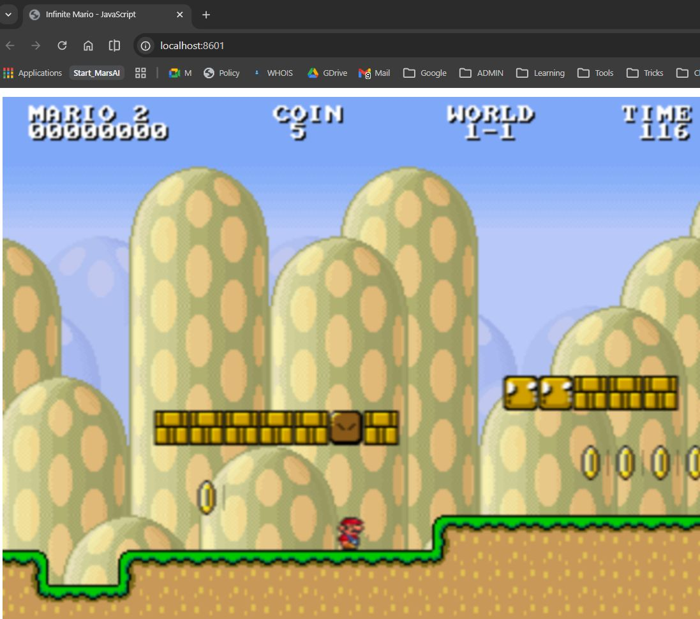
**Instance 2 :**
```
http://localhost:8600
```

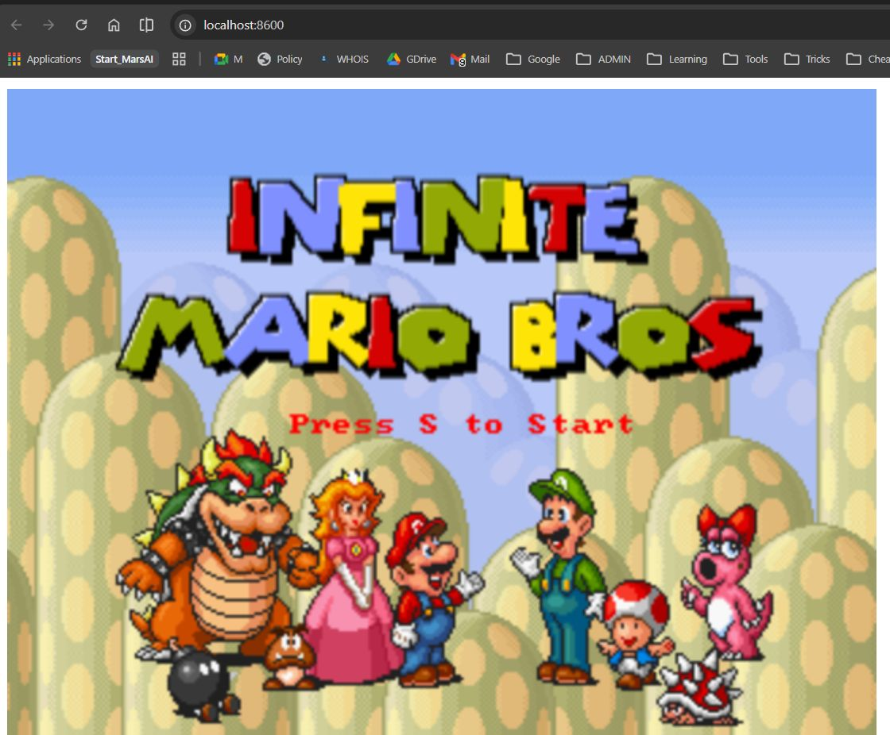

> Les 2 instances fonctionnent indépendamment. Vous pouvez jouer sur les deux en parallèle.

**Vue des conteneurs actifs :**


> Les 2 conteneurs tournent simultanément. Vous pouvez vérifier avec `docker ps`.

---

#### **8. Arrêter les conteneurs (Méthode : Par ID)**

**Arrêter le 1er conteneur :**
```bash
docker stop <container_id_1>
```


> Arrête gracieusement le conteneur (donne 10 secondes pour arrêter proprement).
>
> **Résultat :** L'ID du conteneur est affiché, confirmant l'arrêt.
>
> **Note :** L'utilisateur doit remplacer `<container_id_1>` par l'ID réel (ex: `a1b2c3d4e5f6`).

**Arrêter le 2e conteneur :**
```bash
docker stop <container_id_2>
```

> Arrête le 2e conteneur .
>
> **Alternative (arrêter tous les conteneurs) :**
> ```bash
> docker stop $(docker ps -q)
> ```

---

#### **9. Supprimer les conteneurs (Méthode 1 : Par ID)**

```bash
docker rm <container_id_1> <container_id_2>
```

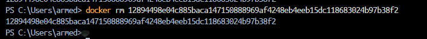

> Supprime les 2 conteneurs. Les IDs doivent être séparés par des espaces.
>
> **Résultat :** Les IDs des conteneurs supprimés sont affichés.

---

#### **10. Supprimer l'image Super Mario**

```bash
docker rmi pengbai/supermario
```

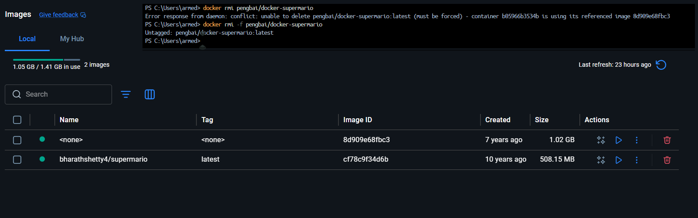

> Supprime l'image `pengbai/supermario` du système local.
>
> **Résultat :** L'ID de l'image supprimée est affiché.
>
> **Attention :** L'image doit **ne pas être utilisée** par un conteneur (arrêté ou actif), sinon une erreur apparaît.

---

### PHASE 2 : Manipulation via DOCKER DESKTOP (Méthode GUI)

#### **Avantage de Docker Desktop**
- Interface graphique intuitive
- Visualisation en temps réel des conteneurs et images
- Gestion avec des clics (sans ligne de commande)
- Idéale pour les débutants

---

#### **1. Ouvrir Docker Desktop**

> Docker Desktop doit être en cours d'exécution. Cherchez l'icône Docker dans la barre système (Windows : en bas à droite) ou lancez l'application.


> Vue de l'onglet **Images**. L'image `pengbai/supermario` y apparaît.

---

#### **2. Naviguer vers l'onglet IMAGES**


> **Actions possibles :**
> - ✅ Voir toutes les images téléchargées
> - 🔍 Rechercher une image
> - ▶️ Lancer un conteneur depuis une image (bouton "RUN")
> - 🗑️ Supprimer une image

---

#### **3. Naviguer vers l'onglet CONTAINERS**

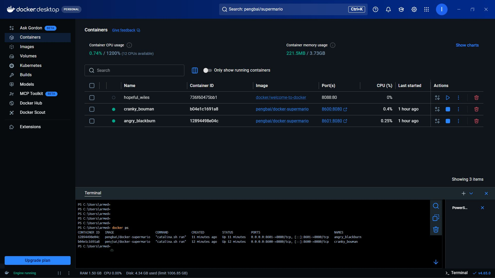

> **Informations affichées :**
> - Conteneurs en cours d'exécution
> - Statut (Running, Stopped, Exited)
> - Ports mappés (8600:8080, 8601:8080, etc.)
> - Options rapides (Stop, Delete, Open in browser, etc.)

**Avec 2 conteneurs en cours :**


> Les 2 instances de Super Mario sont visibles côte à côte.

**Avec 3 conteneurs (variante) :**


> Exemple avec 3 instances simultanées.

---

#### **4. Lancer un conteneur depuis Docker Desktop**

**Depuis l'onglet Images :**

1. Selectionnez `pengbai/supermario`
2. Cliquez sur le bouton **"RUN"** (triangle bleu ▶️)
3. Une fenêtre apparaît :
   - **Container name** : Donnez un nom (optionnel, ex: `mario-8600`)
   - **Ports** : Entrez `8600:8080` (ou `8601:8080` pour la 2e instance)
   - **Cliquez "RUN"**


> Les conteneurs apparaissent immédiatement dans l'onglet **Containers**.

---

#### **5. Accéder au jeu depuis Docker Desktop**

**Depuis l'onglet Containers :**

1. Localisez le conteneur `pengbai/supermario`
2. Cliquez sur le port (ex: `8601:8080`)
3. **Automatiquement**, votre navigateur s'ouvre à http://localhost:8601

ou

Cliquez directement sur le **bouton "Open in browser"** (icône globe 🌐).


> Le jeu est accessible et jouable immédiatement.

---

#### **6. Arrêter un conteneur depuis Docker Desktop**

**Depuis l'onglet Containers :**

1. Localisez le conteneur
2. Cliquez sur le bouton **"STOP"** (icône ⏸️ ou carré rouge)

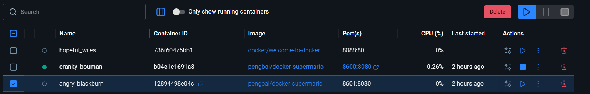

> Le statut devient **"Exited"** (arrêté).

Variante :


> L'interface peut afficher légèrement différemment, mais le fonctionnement est identique.

---

#### **7. Supprimer un conteneur depuis Docker Desktop**

**Depuis l'onglet Containers :**

1. Localisez le conteneur **arrêté**
2. Cliquez sur le bouton **"DELETE"** (icône 🗑️ ou croix rouge)
3. Confirmez la suppression

> Le conteneur disparaît de la liste.

---

#### **8. Supprimer une image depuis Docker Desktop**

**Depuis l'onglet Images :**

1. Localisez `pengbai/supermario`
2. Cliquez sur le bouton **"DELETE"** (icône 🗑️)
3. Confirmez


> L'image `pengbai/supermario` disparaît de la liste des images.

---

### PHASE 2 BONUS : Gestion avancée

#### **Renommer un conteneur via Docker Desktop**

Certaines versions permettent de cliquer sur le nom du conteneur pour le renommer (ex: `mario-8600` au lieu du nom généré).

---

#### **Afficher les détails au clic droit**

Clic droit sur un conteneur → **Inspect** : affiche toute la configuration (réseau, variable d'environnement, etc.).

---

#### **Événements en temps réel**

L'onglet **Dashboard** montre les événements en temps réel (démarrages, arrêts, suppressions).

---

### Résumé Job 02 - Comparaison des 2 Méthodes

| Action | Terminal (CLI) | Docker Desktop (GUI) |
|--------|---|---|
| **Rechercher image** | `docker search pengbai/supermario` | Onglet "Images" → Recherche |
| **Télécharger** | `docker pull pengbai/supermario` | Automatique lors du "RUN" |
| **Lancer conteneur** | `docker run -itd -p 8600:8080 ...` | Onglet "Images" → "RUN" + formulaire |
| **Vérifier état** | `docker ps` | Onglet "Containers" (temps réel) |
| **Accéder au jeu** | Ouvrir http://localhost:8600 | Clic sur port ou "Open in browser" |
| **Arrêter** | `docker stop <id>` | Clic "STOP" |
| **Supprimer conteneur** | `docker rm <id>` | Clic "DELETE" |
| **Supprimer image** | `docker rmi pengbai/supermario` | Onglet "Images" → "DELETE" |

---

### Concepts clés apprises (Job 02)

✅ **Port mapping** : Exposer plusieurs conteneurs sur des ports différents
✅ **Instances multiples** : Lancer plusieurs conteneurs de la même image
✅ **CLI vs GUI** : Deux interfaces pour le même résultat
✅ **Conteneurs responsables** : Chaque conteneur est isolé et indépendant
✅ **Docker Desktop professionnel** : Utilisation pratique pour développeurs
✅ **Gestion complète du cycle de vie** : pull → run → stop → rm → rmi

---

### ✅ Job 02 (alt.) - Résumé Tableau

| Étape | Commande / Action | Capture | Résultat |
|-------|------------------|---------|----------|
| **Rechercher (Terminal)** | `docker search pengbai/supermario` | 12 | Images trouvées ✅ |
| **Télécharger** | `docker pull pengbai/supermario` | 13 | Image récupérée ✅ |
| **Vérifier image** | `docker images` | 14 | penbaï/supermario présent ✅ |
| **Lancer 1er conteneur** | `docker run -itd -p 8600:8080 ...` | 15 | Port 8600 ✅ |
| **Lancer 2e conteneur** | `docker run -itd -p 8601:8080 ...` | 16 | Port 8601 ✅ |
| **Vérifier (Terminal)** | `docker ps` | 17 | 2 conteneurs ✅ |
| **Vérifier (Desktop)** | Onglet Containers | 17.1 / 17.2 | 2-3 conteneurs visibles ✅ |
| **Accéder au jeu (8600)** | http://localhost:8600 | 20 | Mario jouable ✅ |
| **Accéder au jeu (8601)** | http://localhost:8601 | 21 | Mario jouable ✅ |
| **Images (Desktop)** | Onglet Images | 18 | pengbai/supermario visible ✅ |
| **Arrêter (Terminal)** | `docker stop <id>` | 23 | Conteneur arrêté ✅ |
| **Arrêter (Desktop)** | Clic "STOP" | 24 / 24.1 | Conteneur arrêté ✅ |
| **Supprimer par ID** | `docker rm <container_id>` | 25 | Conteneur supprimé ✅ |
| **Supprimer par nom** | `docker rm <container_name>` | 25.5 | Conteneur supprimé ✅ |
| **Vérifier suppression** | `docker ps -a` | 25.6 | Aucun conteneur ✅ |
| **Supprimer image** | `docker rmi pengbai/supermario` | 26 | Image supprimée ✅ |
| **Image supprimée (Desktop)** | Onglet Images | 27 | pengbai/supermario absent ✅ |

---

## Job 03 : Démarrer un serveur Nginx avec Docker 🌐

**Objectif :** Lancer un serveur web Nginx dans un conteneur Docker, le configurer et manipuler ses fichiers en temps réel. Cet exercice démontre comment accéder à l'intérieur d'un conteneur actif et modifier ses fichiers dynamiquement.

**Prérequis :** Job 01 et 02 complétés, Docker opérationnel.

**Image utilisée :** `nginx` (image officielle)
**Port exposé :** 8080 (machine) → 80 (conteneur Nginx)

---

### 1. Lancer le serveur Nginx

**Commande :**
```bash
docker run -d -p 8080:80 nginx
```

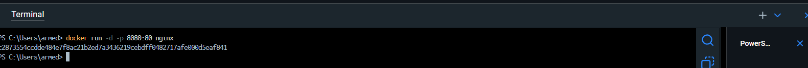

> **Explication des options :**
> - `run` : crée et lance un new conteneur
> - `-d` : mode détaché (daemon) - exécute en arrière-plan
> - `-p 8080:80` : mappe le port 8080 de la machine au port 80 du conteneur Nginx
> - `nginx` : l'image Docker officielle Nginx
>
> **Résultat :** Un ID de conteneur long s'affiche (ex: `a1b2c3d4e5f6...`). Le serveur Nginx démarre immédiatement en arrière-plan sur le port 8080.
>
> **Important :** Nginx écoute en interne sur le port 80. Grâce au mapping `-p 8080:80`, vous pouvez y accéder via le port 8080 de votre machine.

---

### 2. Vérifier que le conteneur est actif

**Commande :**
```bash
docker ps
```


> Affiche la liste des conteneurs en cours d'exécution.
>
> **Colonnes importantes :**
> - `CONTAINER ID` : ID unique du conteneur (ex: `a1b2c3d4e5f6`)
> - `IMAGE` : `nginx` (l'image lancée)
> - `COMMAND` : `nginx -g daemon off;` (la commande exécutée à l'intérieur)
> - `CREATED` : Timestamp de création
> - `STATUS` : `Up X seconds` (conteneur actif depuis X secondes)
> - `PORTS` : **`0.0.0.0:8080->80/tcp`** (le mapping de port en action)
> - `NAMES` : Nom généré automatiquement (ex: `graceful_darwin`)
>
> **Note :** Tous les conteneurs Nginx lancés ultérieurement continueront à afficher le port mapping.

---

### 3. Accéder à la page d'accueil Nginx via navigateur

**Ouvre un navigateur web et va à :**
```
http://127.0.0.1:8080
```

ou

```
http://localhost:8080
```


> **Résultat attendu :** Une page HTML blanche affichant :
>
> ```
> Welcome to nginx!
>
> If you see this page, the nginx web server is successfully installed and
> working. Further configuration is required.
> ...
> ```
>
> **Signification :** Le serveur web est opérationnel et répond aux requêtes HTTP.

---

### 4. Accéder au bash du conteneur (accès interne)

Pour modifier le contenu serveur, tu dois accéder au **bash (terminal)** du conteneur.

**Commande :**
```bash
docker exec -ti <CONTAINER_ID> bash
```

**Exemple concret :**
```bash
docker exec -ti a1b2c3d4e5f6 bash
```

*(Remplace `a1b2c3d4e5f6` par l'ID réel de ton conteneur)*

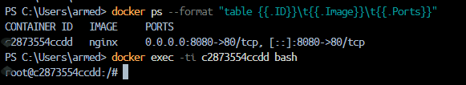

> **Explication :**
> - `docker exec` : exécute une commande **à l'intérieur** d'un conteneur actif
> - `-t` : alloue un pseudo-terminal (tty)
> - `-i` : rend l'entrée interactive (stdin)
> - `bash` : la commande à exécuter (le shell bash)
>
> **Résultat :** Le prompt change vers quelque chose comme :
> ```
> root@a1b2c3d4e5f6:/#
> ```
> Tu es maintenant **connecté à l'intérieur du conteneur**, comme si tu utilisais SSH sur une machine Linux distante. Chaque commande que tu tapes s'exécute **dans le conteneur**, pas sur ta machine.

---

### 5. Naviguer vers le dossier des fichiers web

Nginx stocke les fichiers web dans `/usr/share/nginx/html`.

**Commande :**
```bash
cd /usr/share/nginx/html
ls -la
```

*(À exécuter dans le bash du conteneur)*


> **Résultat attendu :**
> ```
> total 8
> drwxr-xr-x 1 root root 4096 ...  .
> drwxr-xr-x 1 root root 4096 ...  ..
> -rw-r--r-- 1 root root  615 ...  index.html
> ```
>
> **Explication :**
> - `cd` : change le répertoire de travail
> - `ls -la` : liste tous les fichiers avec permissions détaillées
> - `.` = répertoire courant
> - `..` = répertoire parent
> - `index.html` : le fichier HTML servi par défaut quand on accède à http://localhost:8080
>
> **Taille :** 615 octets (le contenu par défaut de Nginx)

---

### 6. Afficher le contenu du fichier index.html

**Commande :**
```bash
cat index.html
```

*(À exécuter dans le bash du conteneur)*


> **Résultat :** Le code HTML du fichier s'affiche dans le terminal.
>
> ```html
> <!DOCTYPE html>
> <html>
> <head>
> <title>Welcome to nginx!</title>
> ...
> </head>
> <body>
> <h1>Welcome to nginx!</h1>
> ...
> </body>
> </html>
> ```
>
> **Comprendre :** C'est ce contenu HTML qui s'affiche quand tu ouvres http://localhost:8080 dans le navigateur.

---

### 7. Modifier le fichier index.html

Il existe 2 méthodes pour modifier le fichier :

#### **Méthode 1 : Modification rapide via commande bash**

**Commande :**
```bash
echo "<h1>Bonjour depuis le conteneur Nginx!</h1>" > index.html
```

*(À exécuter dans le bash du conteneur)*


> **Explication :**
> - `echo` : affiche du texte
> - `> index.html` : redirige la sortie dans le fichier (écrase le contenu)
>
> **Résultat :** Le fichier `index.html` ne contient maintenant que la nouvelle ligne HTML.
>
> **Avantage :** Très rapide, idéal pour des modifications simples.

---

#### **Méthode 2 : Modification avec l'éditeur nano**

**Premièrement, installer nano (s'il n'est pas présent) :**
```bash
apt-get update && apt-get install -y nano
```

**Puis ouvrir le fichier :**
```bash
nano index.html
```

*(À exécuter dans le bash du conteneur)*

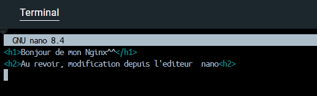

> **Éditeur nano :**
> - Affiche le contenu du fichier
> - Tu peux éditer ligne par ligne
> - Les commandes sont affichées en bas :
>   - `^X` = Ctrl+X : quitter
>   - `^O` = Ctrl+O : sauvegarder
>   - `^W` = Ctrl+W : chercher
>
> **Instructions pour modifier :**
> 1. Navigue avec les flèches du clavier
> 2. Sélectionne tout le texte (Ctrl+A ou via les flèches)
> 3. Supprime (Delete ou Backspace)
> 4. Tape le nouveau contenu
> 5. **Sauvegarde :** Ctrl+X → Y → Enter
>
> **Avantage :** Pour des modifications complexes ou multi-lignes, nano est plus pratique qu'une commande bash.

---

### 8. Vérifier la modification dans le navigateur

**Ouvre ton navigateur et rafraîchis la page :**
```
http://localhost:8080
```

*(Appuie sur F5 ou Ctrl+R pour rafraîchir)*

#### **Résultat après Méthode 1 (bash) :**

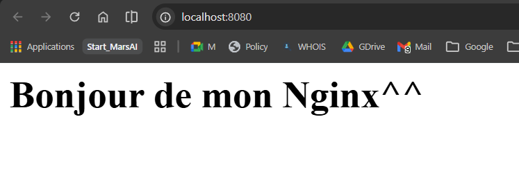

> Affiche simplement :
> ```
> Bonjour depuis le conteneur Nginx!
> ```

---

#### **Résultat après Méthode 2 (nano) :**


> Si tu as modifié le contenu avec nano, le navigateur affichera le nouveau contenu.

---

**Concept important :** Les modifications faites **à l'intérieur du conteneur** sont immédiatement visibles dans le navigateur. Le serveur Nginx récharge le fichier `index.html` à chaque requête HTTP.

---

### 9. Quitter le bash du conteneur

**Commande :**
```bash
exit
```

> Tu reviens au terminal de ta **machine hôte** (pas de screenshot nécessaire).

---

### 10. Arrêter le conteneur Nginx

**Commande :**
```bash
docker stop <CONTAINER_ID>
```

**Exemple :**
```bash
docker stop a1b2c3d4e5f6
```

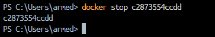

> **Résultat :** L'ID du conteneur s'affiche, confirmant l'arrêt.
>
> **Arrêt gracieux :** La commande `docker stop` attendet 10 secondes avant de forcer l'arrêt. Cela permet au serveur Nginx de terminer proprement ses connexions.
>
> **Comportement :** Le navigateur affichera "Impossible de se connecter" si tu essaies d'accéder à http://localhost:8080.

---

### 11. Vérifier que le conteneur est arrêté

**Commande :**
```bash
docker ps
```


> **Résultat :** Le conteneur Nginx **n'apparaît pas** dans la liste.
>
> **Raison :** `docker ps` affiche uniquement les conteneurs **actifs**. Les conteneurs arrêtés ne sont pas listés.
>
> **Pour voir aussi les arrêtés :**
> ```bash
> docker ps -a
> ```

---

### 12. Supprimer le conteneur

**Commande :**
```bash
docker rm <CONTAINER_ID>
```

**Exemple :**
```bash
docker rm a1b2c3d4e5f6
```


> **Résultat :** L'ID du conteneur s'affiche, confirmant la suppression.
>
> **Différence avec `docker stop` :**
> - `docker stop` : arrête le conteneur (peut le relancer)
> - `docker rm` : supprime le conteneur définitivement
>
> **Note :** Tu dois arrêter le conteneur **avant** de le supprimer. Si tu essaies de supprimer un conteneur actif :
> ```bash
> docker rm a1b2c3d4e5f6
> # Error: You cannot remove a running container
> ```
>
> **Solution :** Utiliser `docker rm -f` (force) ou arrêter d'abord avec `docker stop`.

---

### 13. Vérifier l'absence complète du conteneur

**Commande :**
```bash
docker ps -a
```


> **Résultat :** Pas de trace du conteneur Nginx.
>
> **Explication :**
> - `docker ps` : affiche seulement les actifs
> - `docker ps -a` : affiche tous (actifs + arrêtés + supprimés)
>
> Si le conteneur Nginx n'apparaît pas, il a été complètement supprimé.

---

### 14. Nettoyage du système (optionnel)

Docker accumule des ressources inutiles au fil du temps (images, conteneurs, volumes orphelins, etc.).

**Commande de nettoyage complet :**
```bash
docker system prune
```


> **Résultat attendu :**
> ```
> WARNING! This will remove:
>   - all stopped containers
>   - all networks not used by at least one container
>   - all dangling images
>   - all dangling build cache
>
> Total reclaimed space: 234.5MB
> ```
>
> **Explication :**
> - Supprime les conteneurs arrêtés inutilisés
> - Supprime les images orphelines (non utilisées)
> - Libère de l'espace disque
>
> **Sécurité :** Ne supprime pas les images nommées ou les conteneurs actifs. C'est sûr d'utiliser régulièrement.

---

### Résumé Job 03 - Tableau complet

| Étape | Commande | Résultat | Screenshot |
|-------|----------|----------|-----------|
| 1 | `docker run -d -p 8080:80 nginx` | Conteneur lancé | 28 |
| 2 | `docker ps` | Nginx actif | 29 |
| 3 | Navigateur http://localhost:8080 | Page par défaut | 30 |
| 4 | `docker exec -ti <ID> bash` | Bash prompt | 31 |
| 5 | `cd /usr/share/nginx/html && ls` | Fichiers visibles | 32 |
| 6 | `cat index.html` | HTML affiché | 33 |
| 7a | `echo "..." > index.html` (bash) | Fichier modifié (bash) | 34-bash |
| 7b | `nano index.html` (nano) | Fichier modifié (nano) | 34-nano |
| 8a | Navigateur (après bash) | Contenu modifié (bash) | 35-bash |
| 8b | Navigateur (après nano) | Contenu modifié (nano) | 35-nano |
| 9 | `exit` | Retour au terminal hôte | — |
| 10 | `docker stop <ID>` | Conteneur arrêté | 36 |
| 11 | `docker ps` | Nginx absent | 37 |
| 12 | `docker rm <ID>` | Conteneur supprimé | 38 |
| 13 | `docker ps -a` | Vide complètement | 39 |
| 14 | `docker system prune` | Nettoyage complet | 40 |

---

### Concepts clés apprises (Job 03)

✅ **Port mapping dynamique** : `-p 8080:80` expose un service interne sur un port externe
✅ **Accès interne au conteneur** : `docker exec -ti bash` pour un shell interactif
✅ **Modification de fichiers en temps réel** : Les changements sont immédiatement visibles
✅ **Deux méthodes de modification** : bash (rapide) vs nano (intuitif)
✅ **Différence stop/rm** : stop = en pause, rm = suppression définitive
✅ **Nettoyage système** : `docker system prune` pour libérer de l'espace
✅ **Serveurs web en containers** : Nginx est facilement déployable et configurable

---

### Questions pratiques et réponses

**Q : Que se passe-t-il si je ferme mon terminal sans taper `docker stop` ?**

> A : Le conteneur continue à tourner ! Tu dois l'arrêter explicitement.

---

**Q : Puis-je accéder à un conteneur Nginx arrêté ?**

> A : Non. `docker exec` fonctionne seulement sur les conteneurs actifs. Il faut relancer avec `docker run` ou redémarrer avec `docker start`.

---

**Q : Comment relancer le conteneur Nginx après l'avoir arrêté ?**

> A : Utilise `docker start <ID>` (relance un conteneur existant arrêté) ou `docker run` (crée un nouveau).

---

**Q : Les modifications que j'ai faites persistent-elles après suppression ?**

> A : Non ! Dès que tu supprimes le conteneur avec `docker rm`, toutes les données disparaissent. Pour persistance, il faut utiliser des **volumes** (non couvert ici).

---

### ✅ Job 03 - Synthèse finale

Ce job t'a montré :
1. Comment lancer un serveur web Nginx
2. Accéder à l'intérieur d'un conteneur actif
3. Modifier des fichiers en temps réel
4. Voir les changements immédiatement dans le navigateur
5. Arrêter et nettoyer proprement les ressources

**Prêt pour Job 04 : Apache + PHP phpinfo !** 🚀

---

## Job 04 : Apache + PHP Info

**Objectif :** Créer une image Docker personnalisée contenant PHP, Apache, et un fichier `index.php` affichant les informations du serveur PHP via `phpinfo()`.

**Prérequis :** Job 01, 02, 03 complétés, Docker opérationnel.

**Concepts clés :** Dockerfile, images personnalisées, instructions COPY et EXPOSE, build d'image, port mapping.

---

### PHASE 1 : Préparation des fichiers source

#### 1. Créer le fichier `index.php`

**Commande :**

```bash
echo "<?php phpinfo(); ?>" > index.php
```

ou manuellement avec un éditeur de texte :

```php
<?php phpinfo(); ?>
```


> **Fichier créé :** `index.php` à la racine du projet `dockerStart/`
>
> **Explication :** `phpinfo()` est une fonction PHP qui affiche toutes les informations de configuration du serveur PHP (version installée, modules chargés, extensions, variables d'environnement, directive php.ini, etc.).

---

**Vérifier le contenu :**

```bash
cat index.php
```

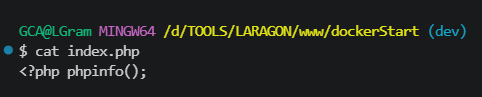

> **Résultat :** Le fichier s'affiche dans le terminal avec le contenu `<?php phpinfo(); ?>`

---

#### 2. Créer le fichier `Dockerfile`

**Commande :**

```bash
cat > Dockerfile << 'EOF'
FROM php:apache

COPY index.php /var/www/html/

EXPOSE 80
EOF
```

ou manuellement avec un éditeur de texte :

```dockerfile
FROM php:apache

COPY index.php /var/www/html/

EXPOSE 80
```


> **Fichier créé :** `Dockerfile` (sans extension) à la racine du projet `dockerStart/`

---

**Vérifier le contenu :**

```bash
cat Dockerfile
```

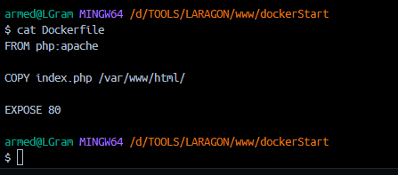

> **Résultat :** Les 3 instructions du Dockerfile s'affichent dans le terminal.

---

**Explication des instructions Dockerfile :**

| Instruction | Explication |
|-------------|-------------|
| `FROM php:apache` | Utilise l'image officielle `php:apache` comme base. Cette image contient PHP et Apache préinstallés. |
| `COPY index.php /var/www/html/` | Copie le fichier `index.php` du système hôte vers le répertoire web du conteneur (`/var/www/html/`). Apache servira ce fichier par défaut. |
| `EXPOSE 80` | Documente que le conteneur écoute sur le port 80 (port standard d'Apache). |

---

#### 3. Vérifier les fichiers créés

**Commande :**

```bash
ls -la
```

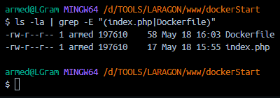

> **Résultat :** Les fichiers créés apparaissent :
> ```
> -rw-r--r--  ... index.php
> -rw-r--r--  ... Dockerfile
> -drwxr-xr-x  ... screenshots/
> ```

---

### Résumé Job 04 - Phase 1

| Étape | Commande | Résultat |
|-------|----------|----------|
| 1 | `echo "<?php phpinfo(); ?>" > index.php` | Fichier `index.php` créé ✅ |
| 2 | `cat index.php` | Contenu vérifié ✅ |
| 3 | `cat > Dockerfile << 'EOF'...` | Fichier `Dockerfile` créé ✅ |
| 4 | `cat Dockerfile` | Contenu vérifié ✅ |
| 5 | `ls -la` | 2 fichiers présents ✅ |

---

### PHASE 2 : Build et exécution

#### 1. Ouvrir un terminal dans le dossier du projet


> Assurez-vous d'être dans le répertoire `dockerStart/` qui contient les fichiers `index.php` et `Dockerfile`.

---

#### 2. Construire l'image Docker

**Commande :**

```bash
docker build -t php-apache-app .
```

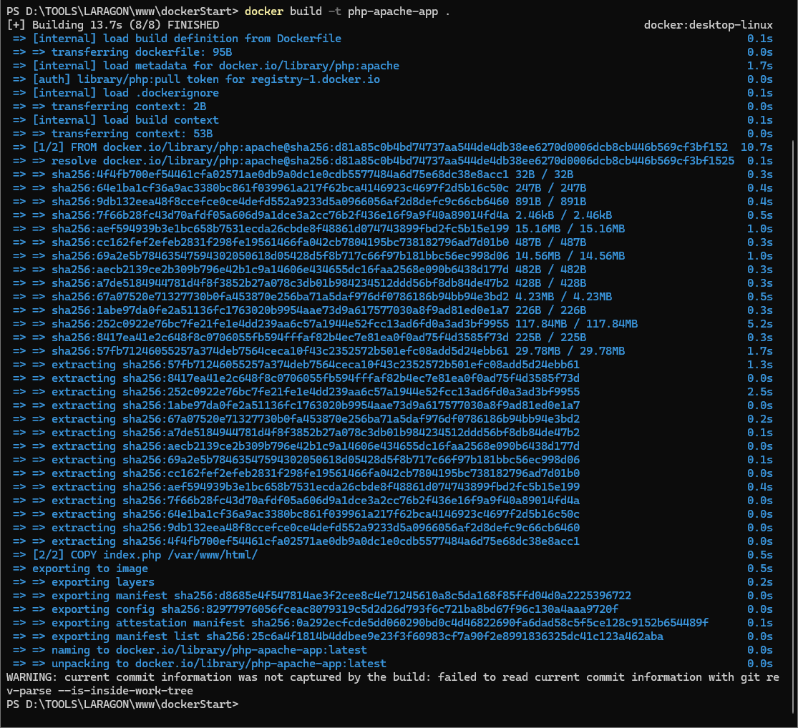

> **Explication :**
> - `docker build` : construit une image Docker basée sur le Dockerfile
> - `-t php-apache-app` : assigne une étiquette (tag) à l'image (nom : `php-apache-app`, tag : `latest`)
> - `.` : utilise le Dockerfile dans le répertoire courant
>
> **Processus :**
> 1. Docker télécharge l'image `php:apache` depuis Docker Hub (première exécution seulement)
> 2. Crée une couche (layer) contenant Apache et PHP
> 3. Copie le fichier `index.php` dans `/var/www/html/`
> 4. Configure le port 80 comme exposé
>
> **Résultat :** `Successfully tagged docker.io/library/php-apache-app:latest`
>
> **Temps estimé :** 10-30 secondes (téléchargement) + extraction des couches.

---

#### 3. Vérifier que l'image a été créée

**Commande :**

```bash
docker images
```

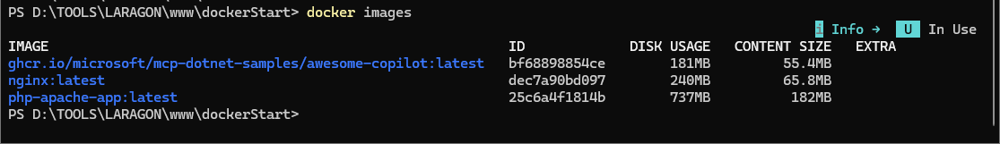

> **Résultat :** L'image `php-apache-app` apparaît dans la liste avec :
> - `REPOSITORY` : `php-apache-app`
> - `TAG` : `latest`
> - `IMAGE ID` : ID unique de l'image
> - `SIZE` : Taille approximative (~450-500 MB)

---

#### 4. Lancer le conteneur

**Commande :**

```bash
docker run -d -p 8080:80 php-apache-app
```


> **Explication :**
> - `docker run` : crée et lance un nouveau conteneur basé sur l'image
> - `-d` : mode détaché (daemon) - exécute le conteneur en arrière-plan
> - `-p 8080:80` : mappe le port 8080 de la machine au port 80 du conteneur Apache
> - `php-apache-app` : l'image à utiliser pour créer le conteneur
>
> **Résultat :** Un ID de conteneur long s'affiche (ex: `a1b2c3d4e5f6...`). Le serveur Apache démarre automatiquement en arrière-plan.

---

#### 5. Vérifier que le conteneur est actif

**Commande :**

```bash
docker ps
```


> **Résultat :** Le conteneur apparaît avec :
> - `CONTAINER ID` : ID unique du conteneur
> - `IMAGE` : `php-apache-app`
> - `STATUS` : `Up X seconds` (conteneur actif)
> - `PORTS` : `0.0.0.0:8080->80/tcp` (port mapping en action)
> - `NAMES` : Nom généré automatiquement

---

#### 6. Accéder à la page phpinfo() dans le navigateur

**Ouvre un navigateur web et accède à :**

```
http://localhost:8080
```

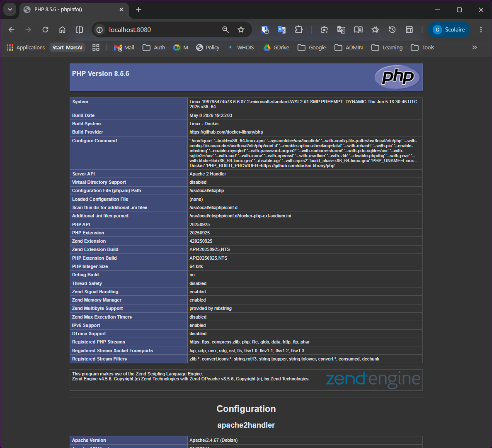

> **Résultat attendu :** La page PHP d'information s'affiche avec :
> - **Titre de page :** `phpinfo()`
> - **PHP Version** : version installée (ex: PHP 8.2.0)
> - **Server API** : `Apache 2.0 Handler`
> - **System** : OS détecté (Linux, Windows, etc.)
> - **Build Date** : date de compilation PHP
> - **Modules PHP chargés** : liste des extensions (gd, curl, json, etc.)
> - **Variables d'environnement** : PATH, HOME, etc.
> - **Directive php.ini** : paramètres de configuration
>
> **Signification :** L'image personnalisée fonctionne correctement. Apache reçoit les requêtes HTTP sur le port 8080 et exécute le fichier PHP.

---

#### 7. Arrêter le conteneur

**Commande :**

```bash
docker stop <CONTAINER_ID>
```

**Exemple :**

```bash
docker stop a1b2c3d4e5f6
```


> **Résultat :** L'ID du conteneur s'affiche, confirmant l'arrêt gracieux.
>
> **Comportement :** Apache arrête de répondre. Le navigateur affichera "Impossible de se connecter" si vous essayez d'accéder à `http://localhost:8080`.

---

#### 8. Supprimer le conteneur

**Commande :**

```bash
docker rm <CONTAINER_ID>
```

**Exemple :**

```bash
docker rm a1b2c3d4e5f6
```

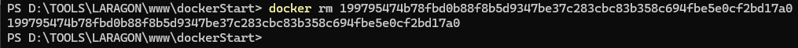

> **Résultat :** L'ID du conteneur s'affiche, confirmant la suppression.
>
> **Différence avec `docker stop` :**
> - `docker stop` : arrête le conteneur (ressources libérées, mais conteneur récupérable)
> - `docker rm` : supprime le conteneur définitivement (données perdues)

---

#### 9. Vérifier la suppression du conteneur

**Commande :**

```bash
docker ps -a
```

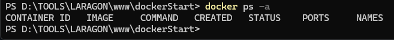

> **Résultat :** Le conteneur n'apparaît plus dans la liste (ni actif, ni arrêté).
>
> **Note :** Si d'autres conteneurs existent, seul le nôtre doit être absent.

---

### Résumé Job 04 - Phase 2 (Build & Run)

| Étape | Commande | Screenshot | Résultat |
|-------|----------|-----------|----------|
| 1 | Terminal dans dockerStart/ | 48 | Terminal prêt ✅ |
| 2 | `docker build -t php-apache-app .` | 49 | Image construite ✅ |
| 3 | `docker images` | 50 | Image visible ✅ |
| 4 | `docker run -d -p 8080:80 php-apache-app` | 51 | Conteneur lancé ✅ |
| 5 | `docker ps` | 52 | Conteneur actif ✅ |
| 6 | http://localhost:8080 | 53 | phpinfo() affichée ✅ |
| 7 | `docker stop <ID>` | 54 | Conteneur arrêté ✅ |
| 8 | `docker rm <ID>` | 55 | Conteneur supprimé ✅ |
| 9 | `docker ps -a` | 56 | Absence confirmée ✅ |

---

### Concepts clés apprises (Job 04)

✅ **Dockerfile personnalisé** : Créer une image basée sur une image officielle
✅ **Instructions Dockerfile** : FROM (image de base) → COPY (fichiers hôte) → EXPOSE (port)
✅ **Build d'image** : `docker build -t` pour compiler une image à partir d'un Dockerfile
✅ **Tag d'image** : Nommer et identifier les images avec `-t nom:tag`
✅ **Port mapping** : `-p hostPort:containerPort` pour exposer des services internes
✅ **Fonction phpinfo()** : Affiche la configuration complète du serveur PHP
✅ **Serveur Apache** : Déployer et tester un serveur web dans un conteneur
✅ **Cycle de vie complet** : build → run → tester → stop → rm

---

### ✅ Job 04 - Résumé final

**Objectif réalisé :** ✅ Image Docker personnalisée avec PHP, Apache et phpinfo()

Ce job a démontré comment :
1. **Créer des fichiers source** : `index.php` (code PHP) et `Dockerfile` (configuration)
2. **Construire une image personnalisée** : `docker build` en utilisant une image de base officielle
3. **Lancer un conteneur** : `docker run` avec mapping de port
4. **Tester l'application** : vérifier que PHP s'exécute correctement
5. **Nettoyer les ressources** : `docker stop` et `docker rm`

**Compétences acquises :** Création d'images Docker, gestion du cycle de vie des conteneurs, intégration d'applications web.

---

**Prêt pour Job 05 : Dockerfile Multistage !** 🚀
