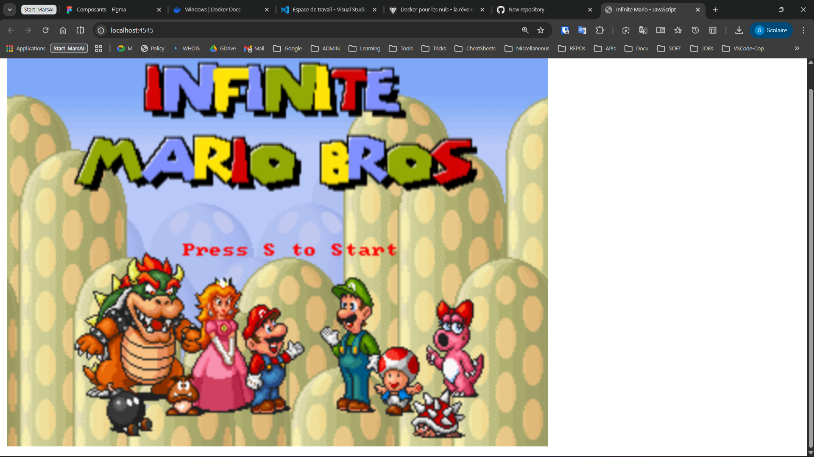
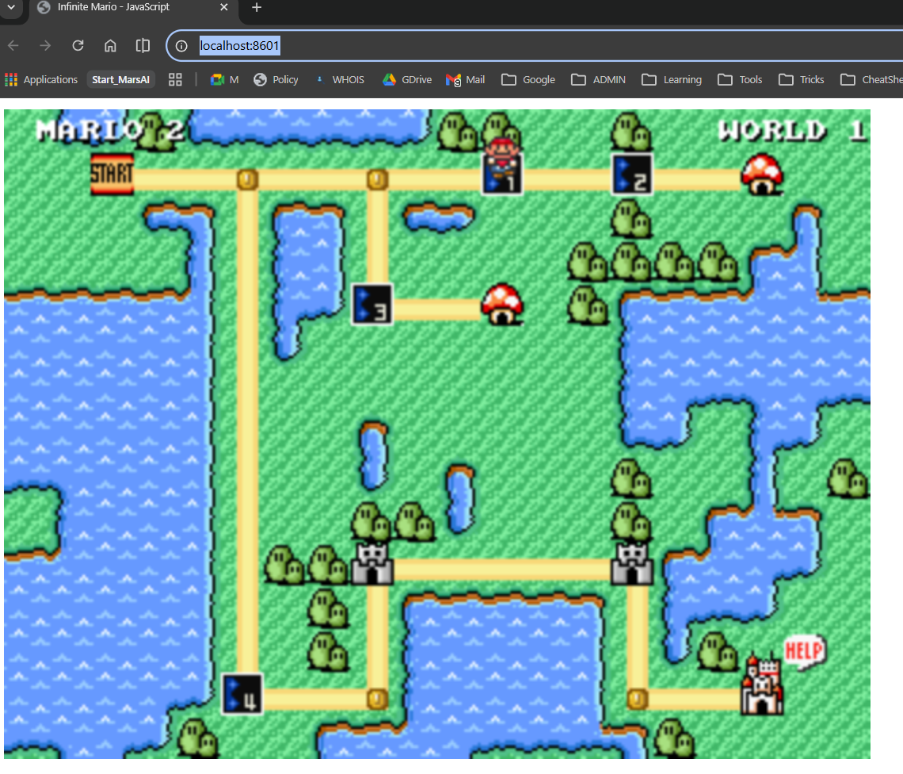

# Docker - Plateforme DWWM

## Job 01 : Welcome to Docker & Commandes de base

**Objectif :** Préparer l'environnement et manipuler les commandes fondamentales.
**Prérequis :** Avoir Docker installé et en cours d'exécution.

¤ [Lien du fichier d'installation](https://docs.docker.com/desktop/install/windows-install/)
¤ [Lien de la documentation](https://docs.docker.com/reference/)

Puis dans Visual-studio ou dans terminal (cmd, powershell...) on va taper les commandes de base pour vérifier que Docker est bien installé et opérationnel.

### 1. Vérification de l'installation

_Pour s'assurer que Docker est bien installé et opérationnel, on vérifie la version :_

```bash
docker --version
# ou docker -v
```


> version **29.2.1** => **docker** est bien installé

### 2. Informations système

```bash
docker info
```


> **info** permet d'afficher toutes les infos du système Docker (Conteneurs, Images, etc.)

---

## Test des commandes de base

### 3. Vérifier les conteneurs en cours d'exécution

```bash
docker ps
```


> Affiche les conteneurs actuellement actifs. Aucun au départ.

### 4. Lister les images disponibles localement

```bash
docker images
```


> Montre les images Docker présentes sur la machine.

### 5. Lancer le conteneur "Welcome to Docker"

```bash
docker run -it --rm -p 8088:80 docker/welcome-to-docker
```


> Lance un conteneur en mode interactif (-it), expose le port 8088 de la machine vers le port 80 du conteneur, et supprime le conteneur automatiquement à l'arrêt (--rm).
>
> **Résultat :** Accès à http://localhost:8088 dans un navigateur
> ***Notes :***
>- Le conteneur doit être arrêté manuellement (CTRL+C) pour revenir au terminal.
>-  Pour faire tourner le conteneur en arrière-plan, utiliser `-d` (détaché) et entrer `docker stop <id>` pour l'arrêter ensuite:
> `docker run -d -p 8088:80 docker/welcome-to-docker`
> puis
>  `docker stop <id>` pour arrêter.
>- Les options `-it` et `-d` peuvent être combinées pour lancer en mode interactif et détaché (mais il faut alors gérer les logs pour voir la sortie du conteneur).

### 6. Arrêter le conteneur

```bash
docker stop <container_id|container_name>
```


> Arrête "gracieusement" le conteneur (sans le supprimer).

### 7. Télécharger l'image hello-world

```bash
docker pull hello-world
```


> Télécharge l'image "hello-world" depuis Docker Hub vers la machine locale.

### 8. Vérifier que l'image est bien présente

```bash
docker images
```


> Hello-world doit maintenant apparaître dans la liste des images locales.

### 9. Lancer le conteneur hello-world

```bash
docker run --rm hello-world
```


> Lance le conteneur hello-world. L'option --rm supprime automatiquement le conteneur après son exécution.
>
> **Résultat :** Affiche un message de bienvenue et s'arrête.

### 10. Actions de suppression - Guide complet

#### **A. Supprimer des CONTENEURS**

**1️⃣ Supprimer un conteneur spécifique** (connu par son ID ou nom)

```bash
# Par ID (avec les premiers caractères)
docker rm a1b2c3d4e5f6

# Par nom complet
docker rm mon-conteneur
```

> ✅ Le conteneur doit être **arrêté** avant la suppression. S'il est actif, un message d'erreur apparaît.

---

**2️⃣ Supprimer plusieurs conteneurs spécifiques**

```bash
# Par IDs
docker rm a1b2c3d4e5f6 g7h8i9j0k1l2

# Par noms
docker rm conteneur1 conteneur2 conteneur3
```

> ✅ Énumérer les IDs ou noms séparés par des espaces.

---

**3️⃣ Supprimer TOUS les conteneurs arrêtés**

```bash
docker rm $(docker ps -a -q)
```

> ⚠️ **Explication :**
> - `docker ps -a` : lister tous les conteneurs (actifs + arrêtés)
> - `-q` : afficher uniquement les IDs (quiet mode)
> - `$(...)` : substitution de commande (exécuter la commande imbriquée)
>
> ✅ Cette commande supprime **TOUS** les conteneurs, y compris les actifs !

---

**4️⃣ Supprimer TOUS les conteneurs arrêtés (méthode sûre)**

```bash
docker container prune
```

> ✅ **Beaucoup plus sûr !** Cette commande supprime uniquement les conteneurs **arrêtés**.
>
> ⚠️ Docker affiche une confirmation avant de procéder.

---

**5️⃣ Forcer la suppression d'un conteneur ACTIF/EN COURS D'EXÉCUTION**

```bash
# Option 1 : Arrêter puis supprimer
docker stop mon-conteneur
docker rm mon-conteneur

# Option 2 : Forcer la suppression directe (non recommandé)
docker rm -f mon-conteneur
```

> ⚠️ **ATTENTION** :
> - `-f` = force (force la suppression sans arrêter d'abord)
> - Cette option peut causer une perte de données si le conteneur écrit encore
> - ✅ Préférer arrêter d'abord avec `docker stop`

---

#### **B. Supprimer des IMAGES**

**6️⃣ Supprimer une image spécifique**

```bash
# Par ID
docker rmi a1b2c3d4e5f6

# Par nom:tag
docker rmi hello-world
docker rmi docker/welcome-to-docker:latest
```

> ✅ L'image doit **ne pas être utilisée** par un conteneur (même arrêté).

---

**7️⃣ Supprimer plusieurs images spécifiques**

```bash
# Par IDs
docker rmi a1b2c3d4e5f6 g7h8i9j0k1l2

# Par noms
docker rmi hello-world ubuntu node:latest
```

> ✅ Énumérer les IDs ou noms séparés par des espaces.

---

**8️⃣ Supprimer TOUTES les images non utilisées**

```bash
docker image prune
```

> ✅ Supprime uniquement les images **orphelines** (non utilisées par aucun conteneur).
>
> ⚠️ Docker affiche une confirmation avant de procéder.

---

**9️⃣ Supprimer TOUTES les images non utilisées (Aggressif)**

```bash
docker image prune -a
```

> ⚠️ **ATTENTION** : Supprime aussi les images **jamais utilisées**.
>
> Utiliser avec prudence !

---

**🔟 Forcer la suppression d'une image**

```bash
# Si l'image est utilisée par un conteneur (même arrêté)
docker rmi -f mon-image:latest

# Ou supprimer le conteneur d'abord (recommandé)
docker rm mon-conteneur
docker rmi mon-image:latest
```

> ⚠️ **ATTENTION** :
> - `-f` = force (supprime même si utilisée)
> - ✅ Meilleure pratique : supprimer les conteneurs d'abord, puis les images

---

#### **C. Démonstration pratique**

**Cas d'usage réel :**

```bash
# 1. Voir l'état actuel
docker ps -a        # Tous les conteneurs
docker images       # Toutes les images

# 2. Arrêter tous les conteneurs actifs
docker stop $(docker ps -q)

# 3. Supprimer les conteneurs arrêtés (méthode sûre)
docker container prune

# 4. Supprimer les images inutilisées (méthode sûre)
docker image prune

# 5. Vérifier le nettoyage
docker ps -a
docker images
```

---

#### **D. Questions pédagogiques du PDF - Synthèse**

| Question | Commande | Notes |
|----------|----------|-------|
| **Supprimer 1 conteneur** | `docker rm <id>` | Doit être arrêté |
| **Supprimer N conteneurs** | `docker rm id1 id2 id3` | Énumérer les IDs |
| **Tous les arrêtés** | `docker container prune` | ✅ Sûr et recommandé |
| **Forcer suppression active** | `docker rm -f <id>` | ⚠️ Risqué, préférer `docker stop` |
| **Supprimer 1 image** | `docker rmi <image>` | Non utilisée requise |
| **Supprimer N images** | `docker rmi img1 img2` | Énumérer les images |
| **Toutes non utilisées** | `docker image prune` | ✅ Sûr et recommandé |
| **Toutes orphelines** | `docker image prune -a` | ⚠️ Plus agressif |
| **Forcer suppression image** | `docker rmi -f <image>` | ⚠️ Risqué |

---

#### **E. Erreurs courantes et corrections**

**❌ ERREUR 1 :** Essayer de supprimer un conteneur actif

```bash
# ❌ Ceci échoue :
docker rm mon-conteneur

# Error response from daemon: You cannot remove a running container...

# ✅ CORRECTION :
docker stop mon-conteneur
docker rm mon-conteneur

# Ou forcer (non recommandé) :
docker rm -f mon-conteneur
```

---

**❌ ERREUR 2 :** Essayer de supprimer une image utilisée

```bash
# ❌ Ceci échoue :
docker rmi mon-image

# Error response from daemon: conflict: unable to remove repository reference...

# ✅ CORRECTION :
# Identifier le(s) conteneur(s) qui l'utilise(nt) :
docker ps -a | grep mon-image

# Supprimer les conteneurs d'abord :
docker rm <container_id>

# Puis supprimer l'image :
docker rmi mon-image
```

---

**❌ ERREUR 3 :** Utiliser `docker rm` au lieu de `docker rmi`

```bash
# ❌ ERREUR (confondre conteneur et image) :
docker rm hello-world  # Ceci cherche un conteneur, pas une image!

# ✅ CORRECTION :
docker rmi hello-world  # Supprimer une image (rmi = rm image)
docker rm conteneur1    # Supprimer un conteneur
```

---

**❌ ERREUR 4 :** Oubli de l'option `-f` quand on force

```bash
# ❌ Ceci ne force pas vraiment :
docker stop -f mon-conteneur  # -f n'existe pas pour stop

# ✅ CORRECTION :
docker kill mon-conteneur     # Tuer le conteneur (force)
# OU
docker rm -f mon-conteneur    # Forcer la suppression (-f sur rm)
```

---

### 10bis. Nettoyage complet (optionnel)

**Arrêter tous les conteneurs actifs :**

```bash
docker stop $(docker ps -q)
```

**Supprimer tous les conteneurs (arrêtés et actifs) :**

```bash
# ⚠️ Attention : supprime vraiment TOUS les conteneurs !
docker rm $(docker ps -a -q)

# ✅ Meilleure pratique (supprime uniquement les arrêtés) :
docker container prune
```

**Supprimer une image :**

```bash
docker rmi hello-world
# ou forcer la suppression (si utilisée)
docker rmi -f docker/welcome-to-docker
```

---

## ✅ Job 01 - Résumé

| Étape              | Commande                                            | Résultat             |
| ------------------ | --------------------------------------------------- | -------------------- |
| Vérif installation | `docker --version`                                  | v29.2.1 ✅           |
| Infos système      | `docker info`                                       | Détails Docker ✅    |
| Conteneurs actifs  | `docker ps`                                         | Aucun au départ ✅   |
| Images présentes   | `docker images`                                     | Aucune au départ ✅  |
| Lancer Welcome     | `docker run -d -p 8088:80 docker/welcome-to-docker` | Conteneur démarré ✅ |
| Arrêter conteneur  | `docker stop <id>`                                  | Conteneur stoppé ✅  |
| Télécharger image  | `docker pull hello-world`                           | Image récupérée ✅   |
| Lancer Hello-World | `docker run --rm hello-world`                       | Message affiché ✅   |

---

## Job 02 : Deploying Mario game on docker container 🍄

**Objectif :** Déployer l'image du jeu Mario sur un conteneur Docker en utilisant les concepts fondamentaux.

**Prérequis :** Job 01 complété, Docker opérationnel.

### 1. Rechercher l'image Mario dans Docker Hub

```bash
docker search mario
```

> Cette commande affiche toutes les images Docker disponibles avec "mario" dans le nom. On cherche l'image `jordangrindrod/mario`.


### 2. Télécharger l'image Mario

```bash
docker pull jordangrindrod/mario
```

> Télécharge l'image `jordangrindrod/mario` depuis Docker Hub vers la machine locale.

### 3. Vérifier que l'image est présente

```bash
docker images
```

> L'image `jordangrindrod/mario` doit maintenant apparaître dans la liste.

### 4. Lancer le conteneur Mario avec mapping de ports

```bash
docker run -itd -p 4545:8080 jordangrindrod/mario
```



**Explications des options :**
- `-i` : mode interactif (interactive mode)
- `-t` : terminal
- `-d` : mode détaché (detach mode) - exécute le conteneur en arrière-plan
- `-p 4545:8080` : mappe le port 4545 de l'hôte au port 8080 du conteneur

> **Résultat :** Le conteneur démarre en arrière-plan et Mario est accessible à `http://localhost:4545`


### 5. Vérifier que le conteneur est en cours d'exécution

```bash
docker ps
```

> Affiche le conteneur Mario en cours d'exécution avec sa configuration.

### 6. Inspecter les détails du conteneur

```bash
docker inspect <container_id>
```

> Affiche tous les détails du conteneur, notamment les ports exposés et les configurations.

### 7. Accéder au jeu Mario

Ouvrez un navigateur et allez à :
```
http://localhost:4545
```


> Le jeu Mario est maintenant accessible et jouable dans le navigateur !

### 8. Arrêter le conteneur

```bash
docker stop <container_id>
```

> Arrête gracieusement le conteneur Mario.

### 9. Supprimer le conteneur

```bash
docker rm <container_id>
```

> Supprime le conteneur (mais l'image reste disponible pour relancer).

---

## ✅ Job 02 - Résumé

| Étape | Commande | Résultat |
|-------|----------|----------|
| Rechercher Mario | `docker search mario` | Images trouvées ✅ |
| Télécharger | `docker pull jordangrindrod/mario` | Image récupérée ✅ |
| Vérifier images | `docker images` | Mario présent ✅ |
| Lancer conteneur | `docker run -itd -p 4545:8080 jordangrindrod/mario` | Conteneur démarré ✅ |
| Vérifier état | `docker ps` | Conteneur actif ✅ |
| Accéder au jeu | `http://localhost:4545` | Mario jouable ✅ |
| Arrêter | `docker stop <id>` | Conteneur stoppé ✅ |
| Supprimer | `docker rm <id>` | Conteneur supprimé ✅ |

**Concepts clés :**
- Port mapping : `-p hostPort:containerPort`
- Mode interactif + terminal + détaché : `-itd`
- Docker Hub et les images publiques
- Gestion du cycle de vie d'un conteneur (run → stop → rm)

---

## Job 02 (alt.) : Super Mario Émulation via Docker Desktop 👾

**Objectif :** Approfondir la manipulation des conteneurs Docker en utilisant **2 méthodes** : le terminal (CLI) et l'interface Docker Desktop (GUI). Cet exercice montre que Docker offre plusieurs interfaces pour gérer les conteneurs.

**Prérequis :** Job 01 et 02 complétés, Docker Desktop installé et ouvert.

**Image utilisée :** `pengbai/supermario` (port intérieur : 8080)

---

### PHASE 1 : Manipulation via TERMINAL (Méthode CLI)

#### **1. Rechercher l'image Super Mario**

```bash
docker search pengbai/supermario
```


> Cette commande affiche toutes les images disponibles contenant "pengbai/supermario" dans Docker Hub. On cherche l'image officielle `pengbai/supermario`.
>
> **Résultat attendu :** Une liste d'images, la première étant `pengbai/supermario` (officielle).

---

#### **2. Télécharger l'image Super Mario**

```bash
docker pull pengbai/supermario
```


> Télécharge l'image `pengbai/supermario` depuis Docker Hub vers la machine locale.
>
> **Temps estimé :** 30 secondes à 2 minutes selon la vitesse internet.
>
> **Résultat :** Les couches (layers) de l'image sont téléchargées et extraites.

---

#### **3. Vérifier que l'image est présente**

```bash
docker images
```


> Affiche la liste complète des images locales. L'image `pengbai/supermario` doit maintenant y apparaître.
>
> **Informations affichées :**
> - `REPOSITORY` : pengbai/supermario
> - `TAG` : latest
> - `IMAGE ID` : Identifiant unique de l'image
> - `SIZE` : Taille de l'image (généralement 150-200 MB)

---

#### **4. Lancer le 1er conteneur Super Mario (Port 8600)**

```bash
docker run -itd -p 8600:8080 pengbai/supermario
```


> **Options expliquées :**
> - `-i` : mode interactif (allows stdin/input)
> - `-t` : alloue un pseudo-terminal (tty)
> - `-d` : mode détaché (daemon) - exécute en arrière-plan
> - `-p 8600:8080` : mappe le port 8600 de la machine au port 8080 du conteneur
>
> **Résultat :** Un ID de conteneur est affiché (ex: `a1b2c3d4e5f6...`). Le conteneur démarre en arrière-plan.
>
> **Accès :** http://localhost:8600

---

#### **5. Lancer le 2e conteneur Super Mario (Port 8601)**

```bash
docker run -itd -p 8601:8080 pengbai/supermario
```


> Lance une **deuxième instance** du jeu Mario sur un port différent (8601).
>
> **Résultat :** Un 2e ID de conteneur est affiché.
>
> **Avantage :** Permet de tester plusieurs instances, ou qu'une personne joue sur chaque port.
>
> **Accès :** http://localhost:8601

---

#### **6. Vérifier les 2 conteneurs en cours d'exécution**

```bash
docker ps
```


> Affiche les conteneurs actuellement actifs.
>
> **Résultat attendu :** 2 lignes, chacune avec :
> - `CONTAINER ID` : ID unique du conteneur
> - `IMAGE` : pengbai/supermario
> - `COMMAND` : Commande de démarrage
> - `CREATED` : Heure de création
> - `STATUS` : Up X minutes (en cours)
> - `PORTS` : **8600→8080** et **8601→8080** (les mapping visibles ici)
> - `NAMES` : Noms générés automatiquement (ex: `jolly_darwin`, `hopeful_babbage`)

---

#### **7. Accéder au jeu via le navigateur**

Ouvrez votre navigateur web et accédez à :

**Instance 1 :**
```
http://localhost:8601
```



> Le jeu Super Mario démarre et est jouable !

**Instance 2 :**
```
http://localhost:8600
```


> Les 2 instances fonctionnent indépendamment. Vous pouvez jouer sur les deux en parallèle.

**Vue des conteneurs actifs :**


> Les 2 conteneurs tournent simultanément. Vous pouvez vérifier avec `docker ps`.

---

#### **8. Arrêter les conteneurs (Méthode : Par ID)**

**Arrêter le 1er conteneur :**
```bash
docker stop <container_id_1>
```


> Arrête gracieusement le conteneur (donne 10 secondes pour arrêter proprement).
>
> **Résultat :** L'ID du conteneur est affiché, confirmant l'arrêt.
>
> **Note :** L'utilisateur doit remplacer `<container_id_1>` par l'ID réel (ex: `a1b2c3d4e5f6`).

**Arrêter le 2e conteneur :**
```bash
docker stop <container_id_2>
```

> Arrête le 2e conteneur .
>
> **Alternative (arrêter tous les conteneurs) :**
> ```bash
> docker stop $(docker ps -q)
> ```

---

#### **9. Supprimer les conteneurs (Méthode 1 : Par ID)**

```bash
docker rm <container_id_1> <container_id_2>
```


> Supprime les 2 conteneurs. Les IDs doivent être séparés par des espaces.
>
> **Résultat :** Les IDs des conteneurs supprimés sont affichés.

---

#### **10. Supprimer l'image Super Mario**

```bash
docker rmi pengbai/supermario
```


> Supprime l'image `pengbai/supermario` du système local.
>
> **Résultat :** L'ID de l'image supprimée est affiché.
>
> **Attention :** L'image doit **ne pas être utilisée** par un conteneur (arrêté ou actif), sinon une erreur apparaît.

---

### PHASE 2 : Manipulation via DOCKER DESKTOP (Méthode GUI)

#### **Avantage de Docker Desktop**
- Interface graphique intuitive
- Visualisation en temps réel des conteneurs et images
- Gestion avec des clics (sans ligne de commande)
- Idéale pour les débutants

---

#### **1. Ouvrir Docker Desktop**

> Docker Desktop doit être en cours d'exécution. Cherchez l'icône Docker dans la barre système (Windows : en bas à droite) ou lancez l'application.


> Vue de l'onglet **Images**. L'image `pengbai/supermario` y apparaît.

---

#### **2. Naviguer vers l'onglet IMAGES**


> **Actions possibles :**
> - ✅ Voir toutes les images téléchargées
> - 🔍 Rechercher une image
> - ▶️ Lancer un conteneur depuis une image (bouton "RUN")
> - 🗑️ Supprimer une image

---

#### **3. Naviguer vers l'onglet CONTAINERS**


> **Informations affichées :**
> - Conteneurs en cours d'exécution
> - Statut (Running, Stopped, Exited)
> - Ports mappés (8600:8080, 8601:8080, etc.)
> - Options rapides (Stop, Delete, Open in browser, etc.)

**Avec 2 conteneurs en cours :**


> Les 2 instances de Super Mario sont visibles côte à côte.

**Avec 3 conteneurs (variante) :**


> Exemple avec 3 instances simultanées.

---

#### **4. Lancer un conteneur depuis Docker Desktop**

**Depuis l'onglet Images :**

1. Selectionnez `pengbai/supermario`
2. Cliquez sur le bouton **"RUN"** (triangle bleu ▶️)
3. Une fenêtre apparaît :
   - **Container name** : Donnez un nom (optionnel, ex: `mario-8600`)
   - **Ports** : Entrez `8600:8080` (ou `8601:8080` pour la 2e instance)
   - **Cliquez "RUN"**


> Les conteneurs apparaissent immédiatement dans l'onglet **Containers**.

---

#### **5. Accéder au jeu depuis Docker Desktop**

**Depuis l'onglet Containers :**

1. Localisez le conteneur `pengbai/supermario`
2. Cliquez sur le port (ex: `8601:8080`)
3. **Automatiquement**, votre navigateur s'ouvre à http://localhost:8601

ou

Cliquez directement sur le **bouton "Open in browser"** (icône globe 🌐).


> Le jeu est accessible et jouable immédiatement.

---

#### **6. Arrêter un conteneur depuis Docker Desktop**

**Depuis l'onglet Containers :**

1. Localisez le conteneur
2. Cliquez sur le bouton **"STOP"** (icône ⏸️ ou carré rouge)


> Le statut devient **"Exited"** (arrêté).

Variante :


> L'interface peut afficher légèrement différemment, mais le fonctionnement est identique.

---

#### **7. Supprimer un conteneur depuis Docker Desktop**

**Depuis l'onglet Containers :**

1. Localisez le conteneur **arrêté**
2. Cliquez sur le bouton **"DELETE"** (icône 🗑️ ou croix rouge)
3. Confirmez la suppression

> Le conteneur disparaît de la liste.

---

#### **8. Supprimer une image depuis Docker Desktop**

**Depuis l'onglet Images :**

1. Localisez `pengbai/supermario`
2. Cliquez sur le bouton **"DELETE"** (icône 🗑️)
3. Confirmez


> L'image `pengbai/supermario` disparaît de la liste des images.

---

### PHASE 2 BONUS : Gestion avancée

#### **Renommer un conteneur via Docker Desktop**

Certaines versions permettent de cliquer sur le nom du conteneur pour le renommer (ex: `mario-8600` au lieu du nom généré).

---

#### **Afficher les détails au clic droit**

Clic droit sur un conteneur → **Inspect** : affiche toute la configuration (réseau, variable d'environnement, etc.).

---

#### **Événements en temps réel**

L'onglet **Dashboard** montre les événements en temps réel (démarrages, arrêts, suppressions).

---

### Résumé Job 02 - Comparaison des 2 Méthodes

| Action | Terminal (CLI) | Docker Desktop (GUI) |
|--------|---|---|
| **Rechercher image** | `docker search pengbai/supermario` | Onglet "Images" → Recherche |
| **Télécharger** | `docker pull pengbai/supermario` | Automatique lors du "RUN" |
| **Lancer conteneur** | `docker run -itd -p 8600:8080 ...` | Onglet "Images" → "RUN" + formulaire |
| **Vérifier état** | `docker ps` | Onglet "Containers" (temps réel) |
| **Accéder au jeu** | Ouvrir http://localhost:8600 | Clic sur port ou "Open in browser" |
| **Arrêter** | `docker stop <id>` | Clic "STOP" |
| **Supprimer conteneur** | `docker rm <id>` | Clic "DELETE" |
| **Supprimer image** | `docker rmi pengbai/supermario` | Onglet "Images" → "DELETE" |

---

### Concepts clés apprises (Job 02)

✅ **Port mapping** : Exposer plusieurs conteneurs sur des ports différents
✅ **Instances multiples** : Lancer plusieurs conteneurs de la même image
✅ **CLI vs GUI** : Deux interfaces pour le même résultat
✅ **Conteneurs responsables** : Chaque conteneur est isolé et indépendant
✅ **Docker Desktop professionnel** : Utilisation pratique pour développeurs
✅ **Gestion complète du cycle de vie** : pull → run → stop → rm → rmi

---

### ✅ Job 02 (alt.) - Résumé Tableau

| Étape | Commande / Action | Capture | Résultat |
|-------|------------------|---------|----------|
| **Rechercher (Terminal)** | `docker search pengbai/supermario` | 12 | Images trouvées ✅ |
| **Télécharger** | `docker pull pengbai/supermario` | 13 | Image récupérée ✅ |
| **Vérifier image** | `docker images` | 14 | penbaï/supermario présent ✅ |
| **Lancer 1er conteneur** | `docker run -itd -p 8600:8080 ...` | 15 | Port 8600 ✅ |
| **Lancer 2e conteneur** | `docker run -itd -p 8601:8080 ...` | 16 | Port 8601 ✅ |
| **Vérifier (Terminal)** | `docker ps` | 17 | 2 conteneurs ✅ |
| **Vérifier (Desktop)** | Onglet Containers | 17.1 / 17.2 | 2-3 conteneurs visibles ✅ |
| **Accéder au jeu (8600)** | http://localhost:8600 | 20 | Mario jouable ✅ |
| **Accéder au jeu (8601)** | http://localhost:8601 | 21 | Mario jouable ✅ |
| **Images (Desktop)** | Onglet Images | 18 | pengbai/supermario visible ✅ |
| **Arrêter (Terminal)** | `docker stop <id>` | 23 | Conteneur arrêté ✅ |
| **Arrêter (Desktop)** | Clic "STOP" | 24 / 24.1 | Conteneur arrêté ✅ |
| **Supprimer par ID** | `docker rm <container_id>` | 25 | Conteneur supprimé ✅ |
| **Supprimer par nom** | `docker rm <container_name>` | 25.5 | Conteneur supprimé ✅ |
| **Vérifier suppression** | `docker ps -a` | 25.6 | Aucun conteneur ✅ |
| **Supprimer image** | `docker rmi pengbai/supermario` | 26 | Image supprimée ✅ |
| **Image supprimée (Desktop)** | Onglet Images | 27 | pengbai/supermario absent ✅ |

---

**Leçons importantes de Job 02 :**
- Même tâche, 2 interfaces différentes (puissance et flexibilité de Docker)
- Port mapping permet d'exposer plusieurs conteneurs meme image sur ports différents
- Docker Desktop est plus intuitif, le terminal est plus rapide pour les experts
- Chaque conteneur est complètement isolé (données, réseau, etc.)
